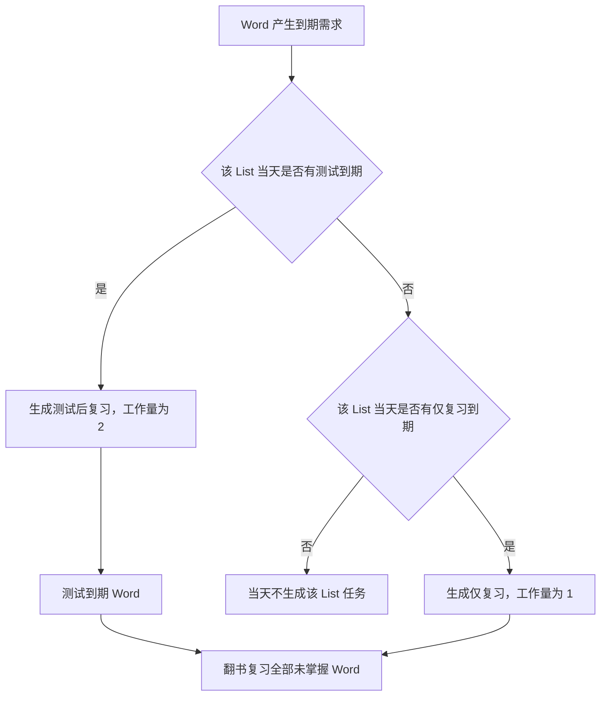

# 复习与测试调度算法规格

## 1. 结论摘要

本项目采用“List 接触曲线、Word 短期状态、List 同步条件、长期验证”四层调度模型。

- 纸质书中的首过和复习始终以 List 为操作单位。
- 软件测试在 List 任务中只测试当日到期的 Word。
- 每个 Word 使用 `0、1、2` 三档短期通过次数，但掌握状态只有未掌握和已掌握两种。
- 当 List 中所有未掌握 Word 的短期通过次数均为 2 时，List 满足同步条件。
- 满足同步条件后，整个 List 停止复习 7 个自然日，再进行长期验证。
- Word 只有通过长期验证才变为已掌握；长期验证失败则把短期通过次数重置为 0。

本项目不使用固定“艾宾浩斯日期表”。第一版的日期增量是可调整的产品参数，用于实现用户已经确认的短期快速记忆与长期验证工作流。

## 2. 研究边界

研究支持以下方向：

- 分散练习通常优于集中突击，但合适间隔会随目标保持时间变化，不存在普遍最优的固定日期表。[Cepeda 等，2008](https://pubmed.ncbi.nlm.nih.gov/19076480/)
- 主动提取比单纯重复阅读更有利于延迟保持，因此掌握判定必须来自测试，而不能来自仅复习。[Roediger 与 Karpicke，2006](https://pubmed.ncbi.nlm.nih.gov/16507066/)
- 测试后的答案反馈本身具有巩固作用，所以一次测试任务包含“软件测试”和“随后翻书复习”两个工作量组成部分。[反馈研究](https://pubmed.ncbi.nlm.nih.gov/37153935/)

研究不能直接确定以下产品参数：

- 首次短期测试采用 `T0 + 1`。
- 第二次短期测试采用 `T0 + 4`。
- 长期验证间隔采用 7 个自然日。
- 等待校验间隔与长期验证间隔共用 7 个自然日。

这些数值是第一版可调整参数，不得在界面或文档中表述为普遍记忆定律。

### 2.1 容量分析基线

- 纸质词书每个 List 固定包含 60 个单词，但软件只调度首过筛出的重点 Word；不得把 60 直接当作每个 List 的活动 Word 数量。
- 用户当前粗略估计首过前已有认识率约为 60%–90%，但该估计尚未经过实际数据验证，并且可能只适用于必考词。常考词和偶考词必须通过真实使用数据分别校准。
- 认识率估计只用于容量分析和压力测试，不参与状态转换、等待校验、同步条件或长期验证规则。

## 3. 正式术语

本文件引用 `docs/需求规格.md` 的核心概念表。算法新增术语如下，必须同步进入该表：

| 术语 | 定义 |
| --- | --- |
| List 接触事件 | 用户对一个 List 发生的一次有效学习接触，类型只能是首过、仅复习或测试后复习 |
| 仅复习 | 不进行软件测试，只翻开纸质书朗读 List 中全部未掌握 Word |
| 测试后复习 | 先在软件中测试到期 Word，再翻开纸质书复习整个 List |
| 短期通过次数 | 未掌握 Word 在短期同步阶段的状态，取值只能是 0、1、2 |
| 短期周期起点 | Word 最近一次进入短期通过次数 0 的日期，记为 `T0` |
| 短期通过次数 1 起点 | Word 最近一次达到短期通过次数 1 的日期，记为 `T1` |
| 等待校验起点 | Word 最近一次达到短期通过次数 2，或最近一次等待校验成功的日期，记为 `T2` |
| 等待校验 | 短期通过次数为 2 的 Word 等待满 7 个自然日后进行的状态校验 |
| 同步条件 | List 中所有未掌握 Word 的短期通过次数均为 2 |
| 长期验证 | List 满足同步条件并停止复习 7 个自然日后，对全部未掌握 Word 进行的测试 |
| 掌握状态 | Word 是否通过长期验证的二值状态，只能是未掌握或已掌握 |

“第三次测试”只能用于口头解释，不得作为正式状态或代码命名，因为失败重测和等待校验可能使实际测试次数超过三次。

## 4. 工作量模型

| List 接触事件 | 用户行为 | 工作量 |
| --- | --- | ---: |
| 首过 | 线下首过、朗读、语音录入并确认 | 1 |
| 仅复习 | 翻书朗读全部未掌握 Word | 1 |
| 测试后复习 | 软件测试到期 Word，随后翻书复习整个 List | 2 |

约束：

1. 测试和测试后的纸质复习分别占 1 个工作量，因此一次测试后复习合计为 2。
2. 同一个 List 同一天同时存在仅复习和测试时，合并为测试后复习，不再额外增加一个仅复习工作量。
3. 即使本次只测试一个 Word，用户仍需翻书复习整个 List，所以测试后复习仍按 2 计算。
4. 系统同时记录实际测试 Word 数量和实际耗时，用于后续校准 List 工作量差异。

常规模式不适用上表。其工作量按条目精确累计：录入一个条目为 1，确认一次条目测试的最终判断为 1，复习页朗读为 0。测试组只是当天的显示切分，绝不作为工作量、排期或掌握状态的计算单位。

## 5. 短期同步阶段

### 5.1 日期增量

对每个未掌握 Word 定义：

```text
T0 = Word 最近一次进入短期通过次数 0 的日期
T1 = Word 最近一次达到短期通过次数 1 的日期
```

第一版使用以下增量：

| 相对日期 | 计划事件 |
| --- | --- |
| `T0 + 1 个自然日` | 第一次短期测试后复习 |
| `T0 + 2 个自然日` | 仅复习 |
| `T0 + 4 个自然日` | 第二次短期测试后复习 |

三个增量都从同一个 `T0` 计算，绝对禁止把它们解释成前一个事件之后再增加相应天数。

当 Word 已经达到短期通过次数 1 时，后续日期由同一组增量做阶段差分，不引入特殊参数：

| 相对日期 | 推导 | 计划事件 |
| --- | --- | --- |
| `T1 + 1 个自然日` | `(T0 + 2) - (T0 + 1)` | 仅复习 |
| `T1 + 3 个自然日` | `(T0 + 4) - (T0 + 1)` | `1→2` 晋级测试后复习 |

`T1` 可以来自正常短期测试成功的 `0→1`，也可以来自等待校验失败的 `2→1`。两种情况使用完全相同的后续排期。正常路径中的 `T1 = T0 + 1`，因此上述日期与原有 `T0 + 2`、`T0 + 4` 完全一致，调度器不得重复生成任务。

正常成功路径在 `T0 + 4` 达到短期通过次数 2，必须短于 7 个自然日的长期验证间隔。

### 5.2 产生新的短期周期起点

以下事件产生新的 `T0`，并取消该 Word 尚未发生的旧短期任务：

1. 新 Word 完成首过并进入短期通过次数 0。
2. 短期通过次数为 0 或 1 的 Word 测试失败并重置为 0。
3. Word 长期验证失败并重置为 0。

失败当天就是新的 `T0`，因此该 Word 在下一个自然日重新测试，符合用户确认的失败后快速回到曲线起点规则。

### 5.3 状态转换

| 当前短期通过次数 | 测试类型 | 最终结果 | 新状态 |
| ---: | --- | --- | ---: |
| 0 | 短期测试 | 认识 | 1，并生成新的 `T1` |
| 0 | 短期测试 | 不认识 | 0，并生成新的 `T0` |
| 1 | 短期测试 | 认识 | 2 |
| 1 | 短期测试 | 不认识 | 0，并生成新的 `T0` |
| 2 | 等待校验 | 认识 | 保持 2，刷新等待校验起点 |
| 2 | 等待校验 | 不认识 | 降为 1，并以校验当天生成新的 `T1` |

仅复习不改变短期通过次数，不改变掌握状态，也不能作为通过概率预测模型的测试成功样本。

### 5.4 测试范围

短期同步阶段的一次 List 测试只包含：

- 当日短期测试到期且短期通过次数小于 2 的 Word；
- 当日等待校验到期且短期通过次数为 2 的 Word。

短期通过次数为 2 且尚未等待满 7 个自然日的 Word 不参加软件测试，但纸质复习时仍然随整个 List 一起朗读。

### 5.5 List 聚合

不同 Word 可以拥有不同的 `T0` 和不同到期日。软件按以下规则聚合：

1. 任一 Word 的测试到期，List 进入测试清单，但只测试真正到期的 Word。
2. 任一 Word 的仅复习到期，List 进入仅复习清单，纸质复习范围是全部未掌握 Word。
3. 同一 List 同一天既有测试又有仅复习时，合并为测试后复习。
4. 一次整 List 纸质复习可以满足同日所有 Word 触发的仅复习需求，但不会修改其他 Word 的 `T0`、测试日期或短期通过次数。
5. 已掌握 Word 默认不显示在软件给出的复习展开列表中；用户依据纸质标记跳过。

## 6. 等待校验

对短期通过次数为 2 的 Word 定义：

```text
T2 = Word 最近一次达到 2，或最近一次等待校验成功的日期
等待校验日期 = T2 + 7 个自然日
```

等待校验的 7 个自然日必须从 `T2` 起算，绝不从该 Word 的 `T0` 或首过日期起算。

如果 List 在等待校验日期之前满足同步条件，该 Word 不再单独校验，直接随 List 进入长期验证阶段。

如果 List 尚未满足同步条件：

- 等待校验成功：短期通过次数保持 2，并从本次校验日期重新计算 7 天。
- 等待校验失败：短期通过次数降为 1，以校验当天生成新的 `T1`，随后统一安排 `T1 + 1` 仅复习和 `T1 + 3` 晋级测试后复习。

多个 Word 同一天等待校验时，合并进同一个 List 测试任务，因此不会产生多个 List 工作量。

## 7. 同步条件与长期验证

### 7.1 同步条件

```text
活动 Word 数量大于 0
并且 List 中所有掌握状态为未掌握的 Word：短期通过次数均为 2
```

空 List 不满足同步条件，不进入长期验证，也不生成后续调度任务。

满足条件后：

1. List 退出短期同步阶段。
2. 取消该 List 尚未发生的仅复习、短期测试和等待校验任务。
3. 完成本次测试后的纸质复习。
4. 以纸质复习完成时间作为长期验证起点 `TS`。
5. 从 `TS` 开始，整个 List 不得再发生任何首过、仅复习或短期测试接触。
6. List 的新增 Word 功能永久上锁；后续长期验证结果不得解除该锁。

### 7.2 长期验证日期

```text
长期验证日期 = TS + 7 个自然日
```

7 天按真实流逝的自然时间计算，而不是按用户打开软件的学习日数量计算。用户数日未打开软件时，记忆仍会衰减。

### 7.3 长期验证状态转换

长期验证测试 List 中全部未掌握 Word：

| 最终结果 | 掌握状态 | 短期通过次数 |
| --- | --- | --- |
| 认识 | 已掌握 | 不再参与短期调度 |
| 不认识 | 未掌握 | 重置为 0，并以长期验证当天生成新的 `T0` |

长期验证完成后仍执行一次纸质复习，因此整个任务计 2 个工作量。

- 所有 Word 均已掌握：List 变为已掌握并退出常规调度。
- 仍有未掌握 Word：List 返回短期同步阶段，只为未掌握 Word生成软件任务和复习提示。

## 8. 测试与复习的统一调度

测试不维护一条与复习割裂的独立日期表。系统先汇总 Word 产生的接触需求，再决定 List 当天的接触事件类型：



长期验证阶段是唯一例外：在长期验证日期到来之前，任何短期接触需求都被同步条件取消，确保完整的无接触间隔。

## 9. 逾期处理

### 9.1 短期任务逾期

- 不生成错过日期的虚拟任务。
- 再次打开应用时只生成当前一次真实任务。
- 同一 List 的多个逾期仅复习折叠为一次。
- 测试与仅复习同时逾期时，先测试再翻书复习，合计工作量为 2。
- 短期通过次数只根据真实测试结果变化，不因逾期自动失败。
- 计划到期日保持不变并用于计算逾期程度；不得把计划到期日静默改写成实际完成日。
- Word 的新状态起点使用真实测试完成日。例如逾期后实际完成 `0→1`，实际完成日才成为新的 `T1`，后续统一安排 `T1 + 1` 仅复习和 `T1 + 3` 晋级测试后复习。
- 仅复习逾期不顺延既有测试。逾期仅复习后来与测试落在同一学习日时，先测试，再用一次整 List 纸质复习同时满足两种需求。

### 9.2 长期验证逾期

- 继续禁止在测试前翻书复习该 List。
- 用户再次打开应用时优先完成长期验证。
- 把真实经过时间交给调度记录，不伪造准时完成。
- 长期验证完成后才恢复纸质复习。

## 10. 每日容量与新增首过建议

用户设置每日目标工作量 `C`：

```text
首过 = 1
仅复习 = 1
测试后复习 = 2
```

每日容量和新增首过数均为建议，不是强制限制。用户可以少做或多做；系统必须保存实际完成量，并以真实执行结果重新建立未来预测。

新增首过建议不能只计算“今日容量减去今日已有任务”，还必须估计今天新增 List 对未来短期测试、仅复习、失败重测、等待校验和长期验证的影响。

第一版采用滚动时域预测框架：

1. 汇总当前逾期任务、今日任务、开放中的未完成任务和所有 Word 的真实状态。
2. 分别模拟今天新增 `0、1、2……` 个 List 后未来若干学习日的 List 级工作量。
3. 模拟时执行同日任务合并，并对测试失败产生的分支进行概率建模，不能只计算全部测试成功的理想路径。
4. 在每日容量约束下，选择能够推进最多首过且未来积压风险仍在容许范围内的最大建议值。
5. 当天实际首过量、测试结果或完成量与建议不同时，下一次计算直接采用真实数据，不惩罚用户，也不伪造原建议已经执行。
6. 每个学习日重新预测，只执行当天建议；未来建议不是承诺，可以随新数据变化。

未来工作量使用蒙特卡洛情景模拟，但必须区分确定项与不确定项：

- 已经到期、已经逾期和由固定锚点直接确定的任务必须精确计算，不得随机化。
- 只有测试成功或失败、List 达到同步条件的时间、等待校验结果和长期验证结果等不确定分支参与抽样。
- 同一个 DailyPlan、相同业务状态和相同算法版本必须使用可复现的固定随机种子，避免用户没有进行任何操作时建议值自行抖动。
- 只有真实完成量、测试结果、用户容量设置或学习状态发生变化时才重建模拟结果。
- 模拟必须输出期望工作量、风险分位数、未来超载概率、最大预计积压和预计清空时间，不能只输出单一新增建议值。

系统同时计算最近 14 个完整学习日的实际日均完成工作量，用于和用户设置的 `C` 对照。该指标只影响风险预测和提示，不得静默修改用户设置的 `C`。不足 14 个完整学习日时使用已有完整学习日，并明确展示样本天数；没有历史时只使用用户目标并标记“尚无实际能力样本”。

M2 前置实验使用固定种子与轻、中、重三档活动 Word 压力样本，对比了今日简单相减、全部测试成功的确定性前瞻和随机前瞻，并比较 14、21、28 个自然日窗口、80%/85%/90% 风险分位数和不同容量预留。结论是：简单相减会明显高估可新增数量；14 天虽能覆盖首轮长期验证，但不能稳定覆盖失败后重新进入短期周期的后续压力；21 天已经覆盖主要失败回路，28 天只增加很小的尾部差异并显著提高计算量。因此第一版采用以下可版本化参数，而不把它们描述为普遍最优值：

- 未来压力预测窗口：21 个自然日。
- 风险分位数：85%。
- 容量预留：`max(1, ceil(C × 15%))`。
- 最近实际日均完成工作量窗口：14 个完整学习日。
- 到期与逾期任务优先占用容量。
- 逾期工作量达到或超过 `C` 时，建议新增首过数为 0。
- 用户仍可主动新增首过，但界面必须展示未来压力变化。

算法版本记录：

- `capacity-monte-carlo-v1`：初版。每个候选新增数量独立完整重放全部存量 List 的随机路径。
- `capacity-monte-carlo-v2`：利用模拟中各 List 演化相互独立的事实，存量 List 路径只模拟一次，候选新增按单 List 路径池求和组合；同一种子下点值与 v1 不同，但联合分布完全一致。`DailyPlan` 额外记录输入指纹，指纹不变（包括跨进程重启）时直接复用已落盘计划，不重新模拟。

优先级：

1. 逾期长期验证。
2. 今日长期验证。
3. 失败后重新到期的短期测试。
4. 等待校验。
5. 其他短期测试。
6. 逾期仅复习。
7. 今日仅复习。
8. 建议新增首过。

以上优先级决定默认排序和新增建议计算，不构成强制执行顺序。除“测试必须先于同一 List 的纸质复习”等记忆有效性约束外，用户可以自由选择先执行其他 List。

## 11. 自由间隔重复调度器与常规模式

词书模式中，自由间隔重复调度器（Free Spaced Repetition Scheduler，FSRS）只作为研究基准和方法论来源，不接入 FSRS 运行时算法库，也不使用 FSRS 输出测试日期。

本项目吸收以下方法：

- 以真实测试时间、真实间隔和最终判断建立不可伪造的事件数据。
- 把“通过概率预测”与“业务排期决策”分离；预测模型只估计未来结果，不拥有排期权。
- 数据不足时采用明确标注的通用先验，积累足够测试后再按用户、Space 和测试阶段校准。
- 使用按时间切分的历史回测，禁止利用未来数据拟合过去。
- 以“每日容量约束下尽量推进首过，同时控制未来积压风险”为显式优化目标。
- 参数更新只影响未来预测，不改写历史事件和既有测试结果。

边界如下：

- 测试日期完全由本项目的 `T0/T1/T2` 规则、List 同步条件和长期验证规则决定。
- 仅复习没有逐词测试结果，不得作为“认识”样本输入通过概率预测模型。
- 通过概率预测模型不得绕过同步条件，不得在 7 天长期验证阶段插入测试或复习。
- 工作量模拟必须在 List 与学习日粒度执行同日合并，不能把 Word 事件直接相加造成重复计量。

本项目最终实现“自有规则调度器、通过概率预测器、工作量模拟器和新增首过决策器”四个职责分离的模块。

常规模式使用 FSRS 作为正式运行时调度器，并遵循以下边界：

1. 每个条目独立维护 FSRS 卡片状态、最终测试结果、真实测试时间、算法版本和参数版本；任何测试组不得参与这些状态的读写。
2. 每日先根据 FSRS 到期结果得到条目集合，按 Word 优先级重排后再以 20 个为默认大小切成仅当日有效的测试组。组的顺序和成员仅用于恢复当日界面，跨学习日不保留为学习对象；次日必须重新计算，不得把前一日未测部分当作冻结快照置顶。
3. 已确认的最终测试判断立即更新该条目的 FSRS 状态，并计 1 个工作量；未确认条目不产生测试事件，次日按条目重新参与到期计算。
4. 复习页只读取当天已产生测试结果的条目，不向 FSRS 写入任何事件。最终“不认识”的条目置顶是显示规则，不是额外的算法权重或排期规则。
5. 常规模式的新增建议以未来 FSRS 条目级到期负荷和每日条目容量为输入；录入和测试各占 1 个单位，朗读复习占 0 个单位。
6. 常规模式只接收两档最终判断：认识映射为 FSRS `Good`，不认识映射为 FSRS `Again`。为了保持按学习日分组的可预期行为，禁用分钟级学习与重学步骤，并关闭随机扰动；默认目标记忆保持率为 0.95。FSRS 权重、参数、库版本和算法版本与每次测试事件一并保存，升级不得重算历史结果。
7. 新条目在录入学习日不自动插入测试组，从下一个学习日开始作为新卡片进入到期计算。不同 Space 的卡片、历史、每日目标和预测完全隔离。

### 11.1 积压场景的跨卡排序

FSRS 的 `due_at` 是单张卡片可提取性 `R` 衰减到当前 Space 配置的目标保持率（默认 0.95）时刻，每张卡片独立维护。FSRS 本身只决定每张卡片的到期日，不规定多张卡片之间的排序；`ORDER BY due_at` 在每日清零的稳态下正确，因为所有到期卡片都会被覆盖，排序只影响先后。

当用户大量录入后次日无法一次测完，到期集合长期无法清零时，排序决定了哪些 Word 先被覆盖。常规模式采用“历史投入优先、近期遗忘加急”的 Word 级规则。这里的“认识／不认识”是产品术语；在调用自由间隔重复调度器（Free Spaced Repetition Scheduler，FSRS）时，分别映射为技术评级 `Good`／`Again`。固定比较键如下：

1. 有至少一次最终测试结果的 Word 优先于从未测试的新 Word。新 Word 的“逾期”只是尚未开始的录入积压，不是被打断的记忆巩固。
2. 在已有测试历史的 Word 中，最近一次最终判断为不认识的优先于最近一次为认识的。前者表示刚发生遗忘，需要尽快回到复习。
3. 同一最近结果内，累计认识次数越多越靠前。不认识绝不清零累计次数：系统保留此前已经投入并成功巩固的历史，并在刚遗忘时优先挽回它。
4. 仍并列时，原始 `due_at` 越早越靠前，最后按稳定 Word 标识打破并列。排序后的序列才按默认每组条目数切分为当日测试组。

理由如下：

- 全新卡片“逾期”只是录入后未及测试的积压，并非记忆衰退；已有历史的 Word 则已经形成应被保护的复习投入。
- 最近一次不认识是唯一的近期例外：它说明旧 Word 刚发生遗忘，不能仅因此前通过次数多而被排到后面。
- 用累计认识次数而不是连续次数，避免一次不认识抹去此前的学习投入；排序只解释今天先处理什么，FSRS 仍独立决定每张卡片何时到期。

该规则只影响当日测试组的展示顺序与分组，不改变任何卡片的 `due_at`、记忆状态、稳定性或工作量；积压集合是有限的，每日测试一部分必然收敛，不会越积越多到失控，也不会生成虚拟补做任务或伪造测试结果。

### 11.1.1 词书模式的跨 List 积压排序

词书模式先在每个 List 内按既有规则把多个 Word 需求折叠为唯一任务；List 是统一纸质复习、同步门禁和长期验证的上层调度单位，不改变任何 Word 的 T0/T1/T2、测试结果或掌握状态。其优先级仍由 Word 决定，而不是由前一日的 List 会话快照或固定阶段决定：

1. 每天重新计算各 List 当前到期 Word 的上述四段 Word 比较键。
2. 以 List 内最优先的到期 Word 作为该 List 的排序键；只要一个 Word 关键，该 List 就应靠前，以便用户按词书位置完成复习与长期门禁。
3. 进入 List 后，当次待测 Word 再按同一规则排序；新到期的关键 Word 可以进入既有 List 的前部。
4. 已暂停会话显示为“继续测试”入口，但恢复时必须按当天 Word 集合与排序重建待测序列，不得把昨日剩余部分冻结在新到期 Word 之前。

任何排序都不能抵消“新增速度长期高于完成能力”造成的总积压，系统只如实显示并引导用户降低新增量。

### 11.2 掌握判定与复习强度

FSRS 卡片状态只有 `Learning`、`Review`、`Relearning` 三种，没有“已掌握”终态；`stability` 随 `Good` 评级增长但永不为零，`due_at` 在 `maximum_interval`（默认 36500 天）封顶前持续推后。常规模式在此基础上派生一个只读的掌握标记，不改变 FSRS 运行时行为：

1. 每次确认最终测试判断并调用 FSRS `review()` 后，取返回的 `due_at` 与本次真实测试时间 `answered_at` 的自然日差值作为“下一次复习间隔”。
2. 若该间隔大于或等于 100 天，则把条目的 `mastery_status` 标记为“已掌握”。阈值 100 天针对考研冲刺期不足 200 天的使用窗口设定：在 `desired_retention=0.95` 下，连续 `Good` 的间隔台阶约为 1、3、8、19、43、89、175 天，第 7 次 `Good` 达到 175 天触发掌握；大于 100 天的阈值对短期目标已无实际意义。
3. 掌握标记是派生状态，不退出 FSRS 调度：已掌握条目在 `due_at` 到期时仍出现在 `list_due_regular_words` 与当日测试组中，仍按 FSRS 规则接受测试，不因标记而隐藏、推迟或改变工作量。
4. 掌握标记可逆：每次最终测试判断后均根据本次 FSRS 输出的下一次复习间隔回写 `mastery_status`。后续 `Again` 会把 `stability` 大幅压缩；只要该间隔低于 100 天，就自动恢复为“未掌握”，不得依赖额外手动操作。

`desired_retention` 控制FSRS 安排的下次间隔长度：值越高，相同 `stability` 下间隔越短、复习越密集。常规模式默认 0.95，高于 FSRS 默认 0.9，使 200 天内复习轮次约从 4 轮提升到 7 轮，避免间隔被拖长到考试之后。该参数存入 `SpaceLearningSettings.fsrs_parameters_json`，按 Space 独立，取值范围 0.80 至 0.99，可在全局设置页修改并需二次确认；修改只影响后续 FSRS 排期，不改写已有测试结果、卡片快照与历史事件。

词书模式的 `mastery_status` 仍只由长期验证改变（第 7 节），不受本节阈值与 `desired_retention` 影响；`desired_retention` 配置仅对常规模式 FSRS 调度器生效，词书模式不使用 FSRS 运行时调度。

## 12. 可解释性要求

每个 List 任务必须能够解释：

- 本次属于首过、仅复习还是测试后复习。
- 任务工作量为什么是 1 或 2。
- 哪些 Word 在本次测试中到期，以及到期原因。
- 哪些 Word 的短期通过次数为 0、1、2。
- 哪些 Word 正在等待校验，以及剩余天数。
- List 是否已经满足同步条件。
- 长期验证的起点、到期时间和实际无接触时长。
- 复习展开列表中的全部未掌握 Word。

## 13. 验收测试

### 13.1 日期增量

- 新 Word 在 `T0 + 1` 产生第一次短期测试。
- `T0 + 2` 产生仅复习；若同日存在测试，则合并为测试后复习。
- `T0 + 4` 产生第二次短期测试。
- 三个日期始终相对于同一个 `T0` 计算。
- 测试失败会取消旧增量并从失败当天生成新的 `T0`。

### 13.2 短期状态

- 0 连续两次成功后变为 2。
- 0 或 1 测试失败后变为 0。
- 2 等待校验成功后保持 2。
- 2 等待校验失败后只降为 1。
- 仅复习不改变任何短期状态。

### 13.3 List 聚合

- 一个 Word 测试到期即可生成 List 测试，但只测试到期 Word。
- 一个 Word 仅复习到期即可生成 List 仅复习，纸质范围为全部未掌握 Word。
- 同日测试与仅复习合并后工作量为 2，而不是 3。
- 一次 List 复习不会修改其他 Word 的短期周期起点。

### 13.4 同步与长期验证

- 仍有一个未掌握 Word 的短期通过次数小于 2 时，不得进入长期验证。
- 全部未掌握 Word 达到 2 后，取消所有短期任务。
- 7 天长期验证阶段不得生成任何纸质复习提示。
- 长期验证成功的 Word 变为已掌握。
- 长期验证失败的 Word 重置为 0，并进入新短期周期。
- 长期验证逾期时，必须先测试，不能先补复习。

### 13.5 工作量与容量

- 首过和仅复习各计 1。
- 测试后复习计 2。
- 每日预测按加权工作量计算，不能再把所有 List 任务等价计为 1。

## 14. 已确定参数与待校准参数

### 14.1 已确定

| 参数 | 第一版取值 |
| --- | --- |
| 第一次短期测试增量 | `T0 + 1 个自然日` |
| 仅复习增量 | `T0 + 2 个自然日` |
| 第二次短期测试增量 | `T0 + 4 个自然日` |
| 达到短期通过次数 1 后的仅复习增量 | `T1 + 1 个自然日`，由原始增量差分得到 |
| 达到短期通过次数 1 后的晋级测试增量 | `T1 + 3 个自然日`，由原始增量差分得到 |
| 等待校验间隔 | 7 个自然日 |
| 长期验证间隔 | 7 个自然日 |
| 首过工作量 | 1 |
| 仅复习工作量 | 1 |
| 测试后复习工作量 | 2 |

### 14.2 使用后校准，不阻塞第一版设计

- 7 天长期验证间隔是否需要增加或缩短。
- 每日容量预留的 15% 是否符合真实失败率。
- 未来压力预测窗口是否继续采用 21 天。
- 通过概率预测模型的数据量门槛、校准频率和风险分位数。

## 15. 研究与实现来源

- Cepeda, N. J. 等，2008，间隔与目标保持期关系：[Spacing effects in learning](https://pubmed.ncbi.nlm.nih.gov/19076480/)
- Roediger, H. L. 与 Karpicke, J. D.，2006，测试效应：[Test-enhanced learning](https://pubmed.ncbi.nlm.nih.gov/16507066/)
- Rawson, K. A. 与 Dunlosky, J.，2022，连续再学习综述：[Successive Relearning](https://journals.sagepub.com/doi/10.1177/09637214221100484)
- Settles, B. 与 Meeder, B.，2016，语言学习半衰期回归：[A Trainable Spaced Repetition Model for Language Learning](https://aclanthology.org/anthology-files/pdf/P/P16/P16-1174.pdf)
- Open Spaced Repetition，FSRS 算法说明：[The Algorithm](https://github.com/open-spaced-repetition/awesome-fsrs/wiki/The-Algorithm)
- Open Spaced Repetition，算法基准：[SRS Benchmark](https://github.com/open-spaced-repetition/srs-benchmark)
