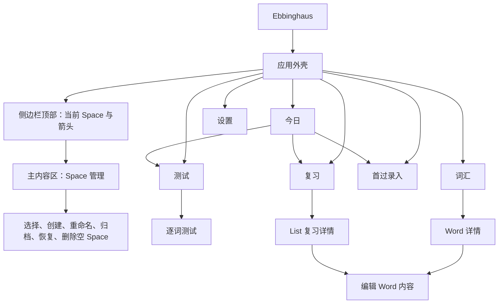

# Ebbinghaus 界面设计规格

## 1. 文档目的与状态

本文定义 Ebbinghaus 的用户界面与用户体验。它承接 `docs/需求规格.md` 的产品语义，只决定用户看到什么、如何操作、系统如何反馈，不改变调度算法、数据库审计字段和测试判断规则。

**当前状态（2026-09-10 起，v2 分支）：视觉设计权限开放给设计执行方（coding agent），由其做主。** v1 界面已按本文实现并正式启用；v2 起本文约束力按下述范围收窄，目的是解除视觉表现层的过度约束，让设计执行方自主决策、整体负责，而不是逐项请示。

继续作为产品约束（变更必须回到用户确认）：

- 第 2 章已确认口径中的信息架构、流程与交互语义；第 3 章目标用户、核心任务与体验完成标准；第 4 章信息架构与一级导航。
- 第 6–13 章由线框和规则表达的用户流程、操作路径、交互逻辑（点击、滑动、快捷键、二次确认、状态反馈语义）与界面大致布局（页面构成与区域结构）。
- 用户文案的语义与术语（术语以 `docs/需求规格.md` 核心概念表为唯一真理源）；措辞细节可在不改变语义与术语的前提下随设计优化。
- 第 15 章禁止进入用户界面的内容；第 16 章可用性验收底线（对比度、最小点击区域、键盘可达、不得只依靠颜色传达状态等）。

降级为 v1 参考、不构成约束（设计执行方可自主重新决策）：

- 第 5 章全部视觉方向与设计令牌：配色、主题色、深色模式、字体、字号、间距、圆角、阴影。
- 各章线框与规则中附带的视觉样式细节：选中态与反馈的具体形式、控件皮肤、卡片样式、徽标图形、图标风格、布局密度与留白、动效。
- 文中涉及 PySide6/Qt 的实现描述（如控件对象名、`make_selectable`）仅为 v1 技术栈记录，不约束 v2 技术选型与实现方式。
- 第 17 章为 v1 交付过程记录，不约束 v2 实施顺序。

移动端（Android）没有既有界面约束，由设计执行方在保持交互逻辑语义一致的前提下全新设计。设计结果通过真实界面截图与桌面/移动端验收反馈迭代。

设计方法仍建议参考三组视角（作为方法参考而非硬性约束）：

- `product-designer`：从用户任务、信息架构、主路径和错误状态出发，禁止从数据库字段反推页面。
- `apple-hig-expert`：遵循 macOS 侧边栏、键盘、焦点、可访问性、语义颜色和足够点击区域等平台习惯。
- `frontend-design`：每个页面只有一个主要职责，文案站在用户一侧，视觉层级克制且具有明确理由。

## 2. 已确认口径

1. 侧边栏顶部显示当前 Space 名称，标题行右侧提供箭头。
2. 点击箭头后，在主内容区域打开 Space 管理页，不使用临时下拉菜单。
3. 首次启动默认创建“必考词”“常考词”“偶考词”；用户可以创建、重命名、归档和恢复 Space。
4. 只有完全没有学习数据的空 Space 可以删除；非空 Space 只能归档。
5. 选择 Space 后立即切换全局上下文，返回进入 Space 管理页之前的页面，刷新当前内容，并显示短暂反馈。
6. 先交付中保真线框和完整文案，用户确认后再修改应用源码。（v1 流程记录；v2 起设计实现与迭代由设计执行方自主推进，验收方式见第 1 章。）
7. 复习与测试是两个独立一级任务，不得继续合并为“复习与测试”。
8. 内部算法、事件名、JSON、会话标识、版本、随机参数和 UTC 时间不得作为用户界面信息。
9. 测试揭示答案后，有可用的在线补充释义时直接展示，不要求用户再次展开。
10. 词汇页默认使用全宽、单列、纵向排列的 Word 卡片，并按录入顺序倒序排列。
11. 点击 Word 卡片后从右侧滑出详情；列表收窄后，左侧 Word 卡片重排为英文、释义、位置与状态三行。
12. 在线词典不展示查询中、成功、缓存或更新时间等状态；只有联网失败且没有可用在线内容时才显示失败提示。
13. 常规模式的测试组默认包含 20 个当日到期条目，仅用于当天显示与工作切分；不得显示为 List 或持久化的学习对象。
14. 常规模式复习页可展示部分测试组，但只展示已有最终测试结果的条目；最终“不认识”的条目必须置顶并标注“刚刚忘记”。
15. 常规模式复习只供朗读和背诵，不提供完成、确认或推迟操作，不计入工作量，也不影响后续排期。
16. 常规模式仅保留“认识 / 不认识”两档测试反馈；不得显示 FSRS 评分术语、`Hard` 或 `Easy`。

## 3. 目标用户与核心任务

### 3.1 目标用户

用户在 macOS 上使用本地应用：可在词书模式中配合纸质考研英语词书完成首过和朗读复习，也可在常规模式中自由积累英文单词与短语。用户不需要理解调度模型，只需要知道今天做什么、为什么现在做、完成后下一步是什么。

### 3.2 用户每天要完成的任务

1. 打开应用，确认当前 Space 和今天最优先的学习动作。
2. 在“测试”中完成软件逐词测试。
3. 在词书模式的“复习”中按 List 翻开纸质词书并确认完成；在常规模式的“复习”中查看当天已测试条目并朗读，不需要确认完成。
4. 根据明确建议决定是否首过新 List，并录入重点 Word。
5. 必要时查找 Word、查看自己的释义和人类可读的学习记录。
6. 在当前 Space 的今日看板调整每日学习目标；在设置中调整时区、换日时间和联网辅助功能。

### 3.3 体验完成标准

- 用户在打开应用后 5 秒内能回答“我现在先做什么”。
- 从今日页进入任一到期任务不超过 2 次点击。
- 用户无需理解“容量、风险分位数、算法版本、T0/T1/T2”等内部术语。
- 复习和测试在导航、列表、页面标题、主按钮和完成反馈中始终分开。
- 任何页面只存在一个视觉最强的主要操作。

## 4. 信息架构



### 4.1 一级导航顺序

1. 今日
2. 复习
3. 测试
4. 首过录入
5. 词汇
6. 设置

“内容维护”不再是一级导航。它从具体 List 或 Word 的上下文进入，避免用户面对没有对象的空白编辑器。

## 5. 视觉方向与设计令牌

> **v2 状态：本章为 v1 视觉实现记录，全部开放重设计，具体取值不再构成约束。** 继续有效的只有第 16 章可用性底线（对比度不低于 4.5:1、最小点击区域、不得只依靠颜色传达状态）。

### 5.1 视觉方向

视觉主题为“安静的纸书学习台”：清晰、稳定、低干扰。特色不来自装饰，而来自真实的“今日学习顺序”和明确的完成反馈。界面不使用营销式大标题、渐变背景、嵌套卡片或无意义图标墙。

### 5.2 颜色

实现时优先使用 Qt/macOS 可随系统外观变化的语义色；以下数值只表达浅色模式设计意图：

| 令牌 | 参考值 | 用途 |
| --- | --- | --- |
| 画布 | `#F4F5F7` | 主内容区背景 |
| 表面 | `#FFFFFF` | 任务行、输入区和详情区 |
| 主文字 | `#1D1D1F` | 标题、正文和关键数字 |
| 次要文字 | `#5F6368` | 日期、解释和辅助信息 |
| 主行动 | `#3157A4` | 主要按钮、选中导航和焦点 |
| 主行动悬停 | `#274786` | 悬停与按下状态 |
| 成功 | `#1E7A46` | 已完成反馈 |
| 警示 | `#A85A00` | 临近积压和需要注意 |
| 逾期 | `#B42318` | 逾期文字、图标和强调线 |
| 分隔线 | `#D8DCE2` | 行分隔和输入边界 |

### 5.3 字体层级

使用 macOS 系统字体，不引入与原生桌面体验冲突的装饰字体。

| 层级 | 建议规格 | 用途 |
| --- | --- | --- |
| 页面标题 | 28pt / 700 | 页面唯一主标题 |
| 区块标题 | 18pt / 600 | 任务分组和详情分组 |
| 任务标题 | 16pt / 600 | Unit、List、Word 和主要状态 |
| 正文 | 15pt / 400 | 解释、义项和表单内容 |
| 辅助文字 | 13pt / 400 | 日期、次要状态和帮助文本 |

禁止使用低于 13pt 的业务文案。辅助文字虽然权重较低，仍必须满足至少 4.5:1 的对比度。

### 5.4 尺寸与间距

- 页面外边距：24pt。
- 区块间距：24pt；组内间距：8pt 或 16pt。
- 主要按钮：最小高度 44pt。
- 侧边栏导航行：最小高度 40pt，整行可点击。
- 图标按钮与 Space 箭头：点击区域至少 44×44pt。
- 次要按钮：最小高度 36pt；危险操作不得缩成难以点击的文字链接。
- 数值输入不得显示 Qt 原生的微型上下分割箭头；字段获得焦点后，`↑` / `↓` 分别增加或减少一个步长。需要鼠标步进时使用独立的圆角减号、加号按钮，单个点击区域至少 44×44pt。
- 左侧栏宽度：248pt；主内容区最小宽度：760pt。
- 建议窗口最小尺寸：1100×760pt；内容变多时允许滚动，不压缩字号或按钮。
- 页面统一采用 24pt 外边距、24pt 区块间距和 16pt 组内间距；空白用于分隔任务层级，不在同一信息组内部制造大面积断层，也不把标题、说明和主操作挤在一起。

## 6. 全局应用外壳

```text
┌──────────────────────────────────────────────────────────────────────────┐
│ ┌────────────── 248pt ─────────────┐ ┌──────────── 主内容区 ───────────┐ │
│ │ Ebbinghaus                       │ │                                  │ │
│ │                                  │ │                                  │ │
│ │ 必考词                       ›    │ │                                  │ │
│ │ ──────────────────────────────── │ │                                  │ │
│ │ ▌ 今日                       2   │ │                                  │ │
│ │   复习                       1   │ │                                  │ │
│ │   测试                       1   │ │                                  │ │
│ │   首过录入                        │ │                                  │ │
│ │   词汇                            │ │                                  │ │
│ │                                  │ │                                  │ │
│ │   设置                            │ │                                  │ │
│ │                                  │ │                                  │ │
│ │ 验收数据（仅开发验收应用显示）    │ │                                  │ │
│ └──────────────────────────────────┘ └──────────────────────────────────┘ │
└──────────────────────────────────────────────────────────────────────────┘
```

### 6.1 导航反馈

- 当前页面使用左侧 3pt 主行动色强调条、浅色选中背景、加粗文字和选中图标。
- 悬停只改变背景，不移动布局。
- 键盘焦点使用清晰焦点环。
- “复习”和“测试”的数量角标只显示未完成数量；为 0 时不显示角标。
- 切换页面后，主内容标题获得辅助功能焦点，屏幕阅读器能立即读出页面名称。

## 7. Space 管理

### 7.1 中保真线框

```text
┌─ Space ─────────────────────────────────────────────────────────────────┐
│ 管理学习范围                                           [创建 Space]     │
│                                                                          │
│ ● 必考词                                                     [编辑]     │
│   当前使用 · 12 个 List                                                  │
│                                                                          │
│ ○ 常考词                                                     [编辑]     │
│   8 个 List                                                              │
│                                                                          │
│ ○ 偶考词                                                     [编辑]     │
│   还没有 List                                                            │
│                                                                          │
│ ▸ 已归档（1）                                                            │
└──────────────────────────────────────────────────────────────────────────┘
```

### 7.2 选择行为

- 点击整行即选择 Space，不要求点小型单选框。
- 选择成功后返回进入管理页前的页面，刷新任务和内容。
- 非阻塞反馈：“已切换到常考词”。
- 当前 Space 行显示“当前使用”，不再提供重复的“选择”按钮。

### 7.3 创建与编辑

创建表单：

- 标题：“创建 Space”
- 字段：“名称”
- 占位：“例如：核心词汇”
- 主要按钮：“创建并使用”
- 次要按钮：“取消”

创建成功后，新 Space 成为活动 Space，并返回原页面。

编辑表单：

- 标题：“编辑 Space”
- 主要按钮：“保存名称”
- 次要操作：“归档 Space”
- 空 Space 额外显示危险操作：“删除 Space”

### 7.4 Space 状态文案

| 场景 | 用户文案 |
| --- | --- |
| 名称为空 | 请输入 Space 名称。 |
| 名称重名 | 已有名为“{名称}”的 Space，请换一个名称。 |
| 归档非当前 Space | 归档“{名称}”？学习记录会保留，之后可以恢复。 |
| 归档当前 Space | 请先切换到另一个 Space，再归档“{名称}”。 |
| 归档最后一个 Space | 至少保留一个可用的 Space。 |
| 删除空 Space | 删除“{名称}”？这个 Space 为空，删除后不再保留。 |
| 删除非空 Space | 这个 Space 已有学习记录，只能归档，不能删除。 |
| 恢复成功 | 已恢复“{名称}”。 |

## 8. 今日页

### 8.1 页面职责

今日页只负责给出明确的下一步、三类任务概况和新增首过建议。它不是统计仪表盘，也不展示预测模型内部数据。

### 8.2 中保真线框

```text
┌─ 今天 · 7月18日 ────────────────────────────────────────────────────────┐
│ 必考词                                                                   │
│                                                                          │
│ ┌─ 下一步 ────────────────────────────────────────────────────────────┐ │
│ │ 测试 Unit 1 · List 4                                  逾期 1 天      │ │
│ │ 还有 1 个词。                                          [开始测试]     │ │
│ └──────────────────────────────────────────────────────────────────────┘ │
│                                                                          │
│ 今天的学习顺序                                                           │
│ ① 测试       1 个 List 待完成                              [查看测试]   │
│ ② 复习       暂无待复习任务                                 [查看复习]   │
│ ③ 首过       今天建议新增 1 个 List                         [开始录入]   │
│                                                                          │
│ 今天已完成 0 项                                             [调整目标]   │
│ 未来一周任务较平稳                                      [为什么这样建议]│
└──────────────────────────────────────────────────────────────────────────┘
```

### 8.3 下一步选择规则

1. 有未完成测试时，词书模式先比较各 List 内当天最优先的到期 Word：已有测试历史者优先、最近不认识者优先、累计认识次数更多者优先；再按原始到期时间与稳定标识打破并列。仅复习排在所有测试之后。
2. 常规模式使用完全相同的 Word 级顺序，再将结果切成当天临时测试组；从未测试的新条目排在已有测试历史的条目之后。
3. 下一步卡片只说明用户可理解的原因，例如“优先复习刚刚忘记的词”或“优先巩固已经多次认识的词”；不得展示阶段枚举、FSRS 评级、累计次数或排序字段。
4. 有已暂停测试会话时显示“继续测试”，但不阻止用户从任务列表选择其他任务。
5. 测试和复习均为空且建议新增时，显示首过录入。
6. 三类任务都为空时，显示完成状态，不制造虚假任务。

推荐顺序不阻塞选择，三个任务入口始终可点击。

### 8.4 今日页文案

| 场景 | 标题 | 说明 | 主要按钮 |
| --- | --- | --- | --- |
| 有测试 | 测试 Unit {U} · List {L} | 还有 {N} 个词。 | 开始测试 / 继续测试 |
| 有复习 | 复习 Unit {U} · List {L} | 请翻开纸质词书复习。 | 去复习 |
| 可首过 | 今天可以学习新 List | 建议新增 {N} 个 List。 | 开始录入 |
| 全部完成 | 今天的任务完成了 | 可以休息，或自行学习新的 List。 | 录入新 List |
| 有积压 | 今天先处理逾期任务 | 仍可自由选择其他任务。 | 查看逾期任务 |
| 无历史样本 | 今天建议新增 {N} 个 List | 暂无近期完成记录，先按你的每日目标估算。 | 开始录入 |

“为什么这样建议”只显示用户可理解的原因，例如：

> 今天有 1 个测试任务。按你的每日目标，完成后还适合学习 1 个新 List。未来一周预计不会超过你的目标。

禁止显示算法版本、风险分位数、随机种子、模拟次数和逐日浮点数。

### 8.5 常规模式今日页

常规模式的今日页不显示 Unit、List、仅复习或纸质复习确认。它以条目测试为唯一待办，并把当天已测试条目的朗读入口作为非阻塞辅助信息。

```text
┌─ 今天 · 7月22日 ────────────────────────────────────────────────────────┐
│ 我的英语积累                                                            │
│                                                                          │
│ ┌─ 下一步 ────────────────────────────────────────────────────────────┐ │
│ │ 测试第 1 组 · 20 个条目                               其中 3 个逾期  │ │
│ │ 完成后可以朗读刚刚测试过的条目。                       [开始测试]     │ │
│ └──────────────────────────────────────────────────────────────────────┘ │
│                                                                          │
│ 今天的学习                                                               │
│ ① 测试       2 组 · 36 个条目待测试                      [查看测试]     │
│ ② 复习       今天已有 1 组可朗读，不计入工作量           [查看复习]     │
│ ③ 录入       今天建议新增 8 个条目                       [录入条目]     │
│                                                                          │
│ 今天已完成 11 / 20 个条目                                [调整目标]     │
│ 未来一周任务较平稳                                      [为什么这样建议]│
└──────────────────────────────────────────────────────────────────────────┘
```

- “今天已完成”只统计已录入条目和已有最终测试结果的条目；朗读复习永远不增加该数字。
- 有未测的到期或逾期条目时，下一步是有效优先级最高的测试组；用户文案说明“优先安排连续巩固更深、较早到期的条目”，组只是进入逐条测试的入口，不是排期或完成对象。
- 没有待测条目时，若当天已有可朗读组，今日页将“查看复习”作为辅助入口；只有没有待测条目且没有建议新增时，才使用“今天的测试完成了”完成状态。
- 常规模式的“为什么这样建议”只说明已有测试负荷、每日条目目标与未来 FSRS 到期压力；不得把朗读复习表述为待办、逾期或工作量。

| 场景 | 标题 | 说明 | 主要按钮 |
| --- | --- | --- | --- |
| 有测试 | 测试第 {G} 组 · {N} 个条目 | 其中 {O} 个逾期。 | 开始测试 / 继续测试 |
| 有可朗读组 | 今天已测试 {N} 个条目 | 可以朗读刚刚测试过的内容。 | 查看复习 |
| 可录入 | 今天可以录入新条目 | 建议新增 {N} 个条目。 | 录入条目 |
| 全部完成 | 今天的测试完成了 | 可以朗读今天的条目，或自行录入新内容。 | 查看复习 / 录入条目 |

## 9. 复习页

### 9.1 中保真线框

```text
┌─ 复习 ─────────────────────────────────────────────────────────────────┐
│ 按 List 翻开纸质词书复习。                                                │
│                                                                          │
│ ┌──────────────────────────────────────────────────────────────────────┐ │
│ │ Unit 2 · List 3                                      今天到期        │ │
│ │ 8 个词需要复习                                                       │ │
│ │ ▸ 查看这 8 个词                                     [完成纸质复习]   │ │
│ └──────────────────────────────────────────────────────────────────────┘ │
│                                                                          │
│ ┌──────────────────────────────────────────────────────────────────────┐ │
│ │ Unit 1 · List 4                                      逾期 1 天       │ │
│ │ 软件测试已完成，现在请复习整张 List。                                │ │
│ │ ▸ 查看需要复习的词                                  [完成纸质复习]   │ │
│ └──────────────────────────────────────────────────────────────────────┘ │
└──────────────────────────────────────────────────────────────────────────┘
```

### 9.2 规则与文案

- 页面不出现尚未完成软件测试的 List。
- 展开 Word 只用于翻书提示，不提供逐词勾选。
- 逾期同时显示警示图标、“逾期 {N} 天”和左侧强调线，不使用整张红色背景。
- 主要按钮始终为“完成纸质复习”。
- 完成反馈：“Unit {U} · List {L} 已完成复习。”
- 空状态标题：“今天没有需要复习的 List”
- 空状态说明：“有新的复习任务时，会显示在这里。”

### 9.3 常规模式复习组

常规模式进入复习页后，页面标题仍为“复习”，但说明改为“查看今天已经测试过的条目，方便朗读和背诵。”页面展示当天至少已有一个最终测试结果的测试组；不要求该组测试完成。

- 打开一个组后只显示已有最终结果的条目及其录入内容，不显示在线词典、不显示未测条目。
- 最终“不认识”的条目始终排在最前，并显示“刚刚忘记”文字和警示图标；其后才显示最终“认识”的条目，避免只依靠颜色表达。
- 页面与组详情均不出现“完成纸质复习”“确认”“稍后”或“推迟”等操作；关闭或离开页面不产生任何学习事件。
- 次日重新计算到期条目与测试组；前一学习日的复习组不继续作为任务显示。

常规模式复习页线框如下：

```text
┌─ 复习 ─────────────────────────────────────────────────────────────────┐
│ 查看今天已经测试过的条目，方便朗读和背诵。                               │
│                                                                          │
│ ┌──────────────────────────────────────────────────────────────────────┐ │
│ │ 第 1 组 · 已测试 12 个条目                         刚刚忘记 3 个      │ │
│ │ ▸ 查看这 12 个条目                                                    │ │
│ └──────────────────────────────────────────────────────────────────────┘ │
│                                                                          │
│  刚刚忘记                                                               │
│  ! look forward to     v. 期待；盼望                                   │
│  ! take over           v. 接管；接任                                   │
│                                                                          │
│  其余已测试条目                                                         │
│    elaborate           a. 详尽的                                       │
│    abandon             v. 放弃                                         │
└──────────────────────────────────────────────────────────────────────────┘
```

组详情不提供完成按钮或快捷键；点击组和展开条目都只是浏览操作。

## 10. 测试页与逐词测试

### 10.1 测试列表线框

```text
┌─ 测试 ─────────────────────────────────────────────────────────────────┐
│ 在软件里逐词检查记忆，完成后再翻开纸质词书复习。                          │
│                                                                          │
│ ┌──────────────────────────────────────────────────────────────────────┐ │
│ │ Unit 1 · List 4                                      逾期 1 天       │ │
│ │ 本 List 尚余 3 个词                                     [继续测试]     │ │
│ └──────────────────────────────────────────────────────────────────────┘ │
│                                                                          │
│ ┌──────────────────────────────────────────────────────────────────────┐ │
│ │ Unit 3 · List 2                                      今天到期        │ │
│ │ 本 List 尚余 6 个词                                     [开始测试]    │ │
│ └──────────────────────────────────────────────────────────────────────┘ │
└──────────────────────────────────────────────────────────────────────────┘
```

空状态：

- 标题：“今天没有需要测试的 List”
- 说明：“新的测试到期后，会显示在这里。”

### 10.2 逐词测试：作答前

```text
┌─ Unit 1 · List 4                         本 List 尚余 4 个词 ──────────┐
│                                                                          │
│                               abandon                                    │
│                                                                          │
│                    [不认识  Backspace]  [认识  Enter]                    │
│                                                                          │
│ [暂停并返回]                                                             │
└──────────────────────────────────────────────────────────────────────────┘
```

### 10.3 逐词测试：答案揭示后

```text
┌─ Unit 1 · List 4                         本 List 尚余 4 个词 ──────────┐
│                               abandon                                    │
│                                                                          │
│ 你的释义                                                                 │
│ v. 放弃                                                                  │
│                                                                          │
│ 在线词典                                                                 │
│ v. 放弃；遗弃                                                            │
│                                                                          │
│               [其实忘记了  Backspace]      [下一个  Enter]              │
└──────────────────────────────────────────────────────────────────────────┘
```

- 有可用在线补充释义时，答案揭示后直接显示在“在线词典”区块，不提供“展开”按钮。
- 在线词典查询成功、缓存命中或正在查询时不显示状态文案；查询完成后有内容就直接出现。缓存内容可以直接使用，不重复联网。
- 当前词没有任何在线缓存时，页面在后台静默补拉一次在线词典：成功即写入共享缓存并在答案区即时补充；失败完全静默（不显示状态文案、不重试、不写失败事件），测试流程绝不依赖网络成功。每个词每次进入测试页最多补拉一次。
- 首次请求发生可恢复的联网失败后，后台自动重试 3 次；全部失败且没有任何可用在线内容时，才显示“暂时无法连接在线词典。”和“重试”。明确无结果、请求取消或结构无效不盲目重试，手录释义始终正常显示。

初判“不认识”后揭示答案，并保留“不认识”按钮且文案切换为“确认不认识，下一个（Enter）”；第二次点击或按 `Enter` 时直接确认最终“不认识”并进入下一词（“进入下一个词”在测试页统一使用 `Enter`，`Backspace` 只表达“不认识／标记为忘记”）。初判“认识”后，点击“标记为忘记（Backspace）”也直接确认最终“不认识”并进入下一词。任一掌握情况都只需要两次操作，绝不提供从“不认识”改回“认识”的路径。

逐词测试页右上角只显示当前容器的剩余待测数量：词书模式显示“本 List 尚余 N 个词”，常规模式显示“本组尚余 N 个条目”。不得显示“第 N / 总数”、总题数或会随当天重排变化的完成比例。

### 10.4 测试完成

软件测试完成后不在测试页直接确认纸质复习：

> 软件测试完成了  
> 现在请翻开纸质词书，复习 Unit 1 · List 4。

主要按钮：“去复习”  
次要按钮：“稍后复习”

“去复习”进入复习页并定位该 List；“稍后复习”返回测试列表，该 List 随即出现在复习页的“等待纸质复习”区域。

### 10.5 常规模式测试组

常规模式的测试列表按当天临时测试组展示，默认每组 20 个到期条目。进入组后仍逐条执行完全相同的测试操作；每一个最终判断立即计入工作量并更新排期。

- 用户可以随时退出；已测条目立即出现在复习页的对应组中，未测条目不形成“组未完成”状态。
- 当一个组内所有条目都已测试时，测试页仅将其从待测列表移除；不会要求纸质复习确认，也不会创建新的复习排期。
- 组内测试页右上角显示“本组尚余 N 个条目”，并随每次最终判断递减；不显示“第 N / 总数”。跨学习日后，未测条目重新参加 Word 级排序与分组，前日剩余数量不得作为今日进度或优先级依据。
- 测试完成反馈为“今天的测试完成了。可以到复习页朗读刚刚测试过的条目。”主要按钮为“去复习”，次要按钮为“返回测试”。

## 11. 首过录入

首过采用三个清晰阶段，不把输入、解析结果和编辑表单同时铺满一页。

### 11.1 第一步：输入

```text
┌─ 录入新 List ───────────────────────────────────────────────────────────┐
│ 今天建议新增 1 个 List · 已完成 0 个                                     │
│                                                                          │
│ Unit [ 1 ]        List [ 5 ]                                             │
│                                                                          │
│ 任意粘贴或输入                                                            │
│ 任意输入或语音转写单词的词性释义与用法，大模型将为你整理词条              │
│ ┌──────────────────────────────────────────────────────────────────────┐ │
│ │ （空文本框，内部无任何占位或示例文字）                                │ │
│ └──────────────────────────────────────────────────────────────────────┘ │
│ ☑ 智能整理内容（需要联网）                                               │
│                                                                          │
│                                                     [整理并检查]         │
└──────────────────────────────────────────────────────────────────────────┘
```

输入卡片标题统一为“任意粘贴或输入”，标题下方一行说明为“任意输入或语音转写单词的词性释义与用法，大模型将为你整理词条”；文本框内部必须完全空白，不得保留任何格式示例、占位文字或诱导固定语法的提示。“直接手动填写”入口文案保持不变。

### 11.2 第二步：检查结果

```text
┌─ 检查识别结果 ─────────────────────────────────────────────────────────┐
│ Unit 1 · List 5 · 识别到 2 个词                                          │
│                                                                          │
│ abandon                                                                  │
│ v.  放弃                                                    [编辑]       │
│ v.  抛弃                                                    [编辑]       │
│                                                                          │
│ elaborate                                      需要确认词性              │
│ a.  详尽的                                                  [编辑]       │
│ v.  详细说明                                                [编辑]       │
│                                                                          │
│ [+ 添加单词]                              [返回修改] [保存这个 List]      │
└──────────────────────────────────────────────────────────────────────────┘
```

警告直接附着到对应 Word 或义项，不建立单独的技术日志区。

### 11.3 第三步：完成

> Unit 1 · List 5 已保存  
> 共录入 2 个重点词，第一次测试将在明天出现。

主要按钮：“继续录入”  
次要按钮：“返回今日”

### 11.4 首过文案

| 当前含混文案 | 正式用户文案 |
| --- | --- |
| 说出或粘贴重点单词和释义 | 任意粘贴或输入 |
| 可以直接粘贴语音转写，不需要先整理格式 | 任意输入或语音转写单词的词性释义与用法，大模型将为你整理词条 |
| 每行一个词，词性可省略，例如……（占位文字） | （已移除：文本框内部完全空白） |
| 原始语音转写 | 说出或粘贴重点单词和释义 |
| 使用大语言模型智能整理 | 智能整理内容（需要联网） |
| 保存草稿并解析 | 整理并检查 |
| 尚未解析 | 输入内容后，点击“整理并检查”。 |
| 结构化手录义项 | 你的释义 |
| 应用到预览 | （按钮已移除：字段编辑完成后自动同步，无条目级保存操作） |
| 一键保存 List | 保存这个 List |
| 明确确认空 List | 这个 List 没有需要记录的词 |

离线失败：

> 智能整理暂时不可用。你的输入已经保留，可以重试或使用本地整理。

按钮：“重试”“使用本地整理”

### 11.5 常规模式录入

常规模式页面标题为“录入条目”，固定采用“输入 → 检查并保存”两步任务流，不显示 Unit、List、固定条目数量或空 List 操作。两步使用同一主内容区域切换，禁止把大段输入框、候选列表、编辑器和最终保存按钮同时铺在一页。

智能整理开启时，第一步只显示：

- 步骤标识“1 输入 / 2 检查并保存”；
- “任意粘贴或输入”标题，下方一行说明“任意输入或语音转写单词的词性释义与用法，大模型将为你整理词条”；
- 完全空白的大段输入框，内部不保留任何占位或格式示例；
- 主要按钮“智能整理并检查”。

自由文本只校验是否为空。界面不得在智能整理前显示规范条目格式说明，也不得对自由文本显示“条目至少需要一条释义”等结构化候选错误。整理失败时原文留在原处，提供“重试”和“改为手动填写”。

智能整理关闭时，进入录入后直接显示第二步，并自动建立一个空白条目；不显示第一步、不调用联网整理，也不要求用户填写供本地解析器识别的格式化文本。

第二步是独立的填写／编辑表单页：

- 顶部显示步骤标识和当前条目数量；智能整理开启时提供“返回修改原文”，关闭时不显示该操作。
- 条目总览按内容所需高度自适应：空列表在原位置显示一行占位文字；有条目时刚好容纳当前卡片。列表最大高度不得超过外侧表单画布的当前可见高度，更多条目在列表内部滚动。每张卡片只展示英文单词或短语、你的释义和非空的例句／用法，不常驻显示原文依据。
- 编辑条目区域同样按当前字段与义项所需高度自适应，并缩减无效留白；最大高度不得超过外侧表单画布的当前可见高度。义项超过可见高度后只在义项区域内部滚动，条目级操作保持可见。
- “添加条目”紧邻条目列表；“保存这组条目”作为唯一主要操作固定在页面底部操作栏，在滚动编辑长内容时仍可见。
- “新增义项”位于义项表单内部最下方；两种模式的字段编辑完成后都自动同步进本次录入，不显示条目级“保存修改”按钮。编辑卡片唯一的外层控制按钮是“从本次录入移除”，固定在编辑卡片标题行右侧，与标题同一水平行。
- 空白、字段错误和模型警告的提示附着到对应条目或字段，并给出下一步；不得只在页面顶部显示无法定位的汇总错误。
- 未提交原文和表单在普通页面切换后保持不变；切换 Space 或主动放弃时必须明确提示会丢弃当前批次。

- 整理预览按条目展示“英文单词或短语”“你的释义”“例句/用法”；例句/用法为空时不渲染空字段。
- 原文依据只用于本地校验，不进入条目总览卡片；模型响应不含 `unresolved_fragments`，本地不计算、不展示未覆盖片段，也不因未覆盖内容生成警告或二次确认。证据高亮集中在原始转写卡片：进入表单页后默认折叠、只显示一行摘要，展开后按模型声明的 `source_excerpt` 在完整原文中集中高亮；非空的 `global_warning` 显示在整个预览内容最下方。
- 警告（字段级与 `global_warning`）一律使用斜体字体，与正文和字段值明显区分；警告文本必须自适应换行，不允许被截断或撑出横向滚动。
- 表单画布与其内部所有区域禁止出现横向滚动或横向平移：任何内容都不得宽于外侧容器，超宽内容通过自适应换行收进可视宽度。
- 词性下拉框、下拉列表和滚动条使用与当前 macOS 界面一致的轻量圆角、清晰悬停和窄轨道视觉，不直接暴露 Qt 默认箭头与滚动条外观。
- 页面底部最终操作统一写“保存本次录入”。保存成功反馈：“已录入 {N} 个条目。它们会从明天开始进入测试安排。”

## 12. 词汇页与内容编辑

### 12.1 默认列表

```text
┌─ 词汇 ─────────────────────────────────────────────────────────────────┐
│ 词汇（页面标题）                                              [筛选]    │
│ 先处理仍在学习的词                                                       │
│ ┌─ 筛选面板（点击“筛选”显示或隐藏，位置保持列表上方）───────┐          │
│ │ Unit：全部  List：全部  状态：全部   搜索：______________ │          │
│ └───────────────────────────────────────────────────────────┘          │
│                                                                          │
│ ┌──────────────────────────────────────────────────────────────────────┐ │
│ │ elaborate        [标记为已掌握]    a. 详尽的；v. 详细说明          ›  │ │
│ │ Unit 1 · List 5 · 今天录入 · 未掌握                              │ │
│ └──────────────────────────────────────────────────────────────────────┘ │
│                                                                          │
│ ┌──────── 右滑态：卡片右移，左侧露出红底删除按钮 ────────┐              │
│ │ [ 删除 ]   abandon                                     │              │
│ └──────────────────────────────────────────────────────────┘          │
│                                                                          │
│ ┌──────────────────────────────────────────────────────────────────────┐ │
│ │ access           [标记为未掌握]   n. 通道；v. 访问   ›  │             │
│ │ Unit 1 · List 3 · 7月15日录入 · 已掌握                            │ │
│ └──────────────────────────────────────────────────────────────────────┘ │
└──────────────────────────────────────────────────────────────────────────┘
```

默认状态规则：

- 所有 Word 卡片在主内容区纵向单列排列，未掌握 Word 位于已掌握 Word 前；同一状态内最新录入的 Word 在最上方，同批录入时保持用户保存时的顺序。
- 每张卡片第一行左侧显示英文词条，右侧显示用户释义；第二行只显示 Unit、List、录入日期和当前用户状态。已掌握词条不使用文字标签：卡片整体置灰一档（浅灰底），英文词条旁显示一枚绿色圆形对勾；详情检查器标题旁同步显示同一对勾。可访问名称保留“已掌握”供辅助技术朗读。
- 卡片整行可点击，并提供清晰的悬停、按下、选中和键盘焦点反馈；右侧箭头只表达可打开详情，不是唯一点击目标。
- “筛选”按钮位于页面顶部标题同一水平行的右侧，是打开筛选面板的唯一开关；筛选面板出现位置保持在标题区下方、词条列表上方，不因按钮挪位改变。
- 筛选面板最右端是搜索框：输入即实时搜索，没有确认或触发按钮，按前缀或模糊方式同时匹配英文词条和中文释义，并与 Unit、List、掌握状态筛选组合生效。
- 筛选与搜索只过滤词条列表，与详情检查器完全解耦：当前选中词条仍在结果中时保持选中与详情打开；只有被过滤掉时才清除选中并自动收起详情。
- 掌握标记是双向手动操作，均不需要二次确认：未掌握卡片悬停时在释义文本左侧显示“标记为已掌握”，已掌握卡片显示“标记为未掌握”；按钮跟随释义排版，不要求跨卡片纵向对齐，采用次要按钮样式，不使用红色或破坏性文案，离开悬停立即隐藏。
- 列表态删除采用滑动删除：Word 卡片可向右拖动，左侧露出红底“删除”按钮，点击立即提交软移除，不需要二次确认；处于滑出状态时任何没有点中删除按钮的鼠标点击都让卡片滑回原位，等于取消删除。展开态卡片不响应滑动，删除改由详情检查器承担。删除后列表立即重建，词条从所属 List（常规模式为所属 Space）消失，历史仅保留审计。
- 默认不展开详情，不保留常驻右侧详情栏，也不通过悬停自动打开。

### 12.2 打开右侧详情

```text
┌─ 词汇 ─────────────────────────────────────────────────────────────────┐
│ [搜索……………………] [Unit：全部] [List：全部] [状态：全部]                 │
│                                                                          │
│ ┌──────────── 列表收窄 ────────────┐ ┌────── 从右侧滑出的详情 ─────────┐ │
│ │ elaborate                       │ │ elaborate              [编辑] [×]│ │
│ │ a. 详尽的；v. 详细说明           │ │ Unit 1 · List 5                  │ │
│ │ Unit 1 · List 5 · 学习中         │ │                                 │ │
│ └─────────────────────────────────┘ │ 你的释义                         │ │
│                                     │ a. 详尽的                        │ │
│ ┌─────────────────────────────────┐ │ v. 详细说明                      │ │
│ │ abandon                         │ │                                 │ │
│ │ v. 放弃；v. 抛弃                 │ │ 学习进度                         │ │
│ │ Unit 1 · List 4 · 学习中         │ │ 已完成 1 / 2 次短期测试          │ │
│ └─────────────────────────────────┘ │ 下次：7月20日测试                │ │
│                                     │                                 │ │
│                                     │ 在线词典                         │ │
│                                     │ adj. 精心制作的                  │ │
│                                     │ adj. 详尽的                      │ │
│                                     │                                 │ │
│                                     │ 学习记录                         │ │
│                                     │ 7月18日 · 第一次测试 · 认识      │ │
│                                     │ 7月16日 · 录入这个词             │ │
│                                     └─────────────────────────────────┘ │
└──────────────────────────────────────────────────────────────────────────┘
```

- 点击卡片后，详情检查器从主内容区右侧滑入，不新开窗口、不覆盖侧边栏，也不改变一级导航选中状态。
- 详情打开后，左侧列表保留浏览位置并收窄；每张卡片自动重排为三行：英文词条、用户释义、Unit/List 与状态。
- 用户释义和在线补充释义在详情中按义项换行，避免多词性、多义项挤成一行。
- 点击其他卡片直接替换详情内容；详情只通过标题行的“收起”按钮或按 `Escape` 收起，并恢复全宽列表；点击详情外其他区域不收起详情。
- 详情检查器宽度建议为 420pt，“收起”按钮保持至少 44×44pt 点击区域并具有“收起词汇详情”的可访问名称。
- 详情标题下方的操作行同时承载“删除词条”危险按钮与掌握标记按钮：删除词条在左，掌握标记在右。未掌握词条显示“标记为已掌握”，已掌握词条显示“标记为未掌握”；两种标记均不需要二次确认，点击即提交：词书模式语义见第 6.8 节（标记已掌握为用户声明的硬掌握终态，标记未掌握重置短期周期），常规模式只改掌握标记、FSRS 照常调度。提交后立即刷新详情与列表。
- “删除词条”按钮点击一次后分裂为“确认删除”和“取消”两个按钮：只有点击“确认删除”才提交软移除，点击“取消”、切换词条或收起详情时撤销未完成的确认。删除后关闭详情并立即刷新列表。
- “学习记录”默认折叠，只显示带箭头的区块标题；用户主动展开后才显示记录内容，再次点击或按 `Escape` 收起，避免历史占用当前释义的首屏空间。

### 12.3 文案与披露规则

- “手录义项（主数据）”统一改为“你的释义”。
- “维基词典补充（在线缓存）”统一改为“在线词典”。有可用内容时直接显示释义，不显示查询状态、缓存状态、提供方或更新时间。
- “完整测试时间线”统一改为“学习记录”。
- 学习记录只显示用户动作和结果，例如“第一次测试 · 认识”“纸质复习完成”。
- 内部事件名、JSON、状态前后对象、算法版本、会话标识和 UTC 时间永不显示。
- 时间使用用户本地日期；当天显示“今天 10:30”，本年显示“7月18日”，跨年显示“2025年12月30日”。
- 未查询、查询中、成功、缓存命中、无结果和内容过期都不显示状态文案；无可用内容时不渲染空的“在线词典”区块。
- 只有联网失败且没有缓存内容时显示：“暂时无法连接在线词典。”并提供“重试”。

### 12.4 内容编辑入口

Word 详情右上角提供“编辑”。进入后只编辑当前 Word 的英文拼写和用户释义；不显示或允许修改记忆状态、下次测试日期和历史。

编辑英文单词或短语与编辑释义使用同一个“保存修改”操作。若英文标题发生变化，点击保存后必须连续显示两次危险确认：第一次说明“修改英文单词或短语会保留现有学习记录和测试安排，请确认这是同一条目。”；第二次说明“确认保存这个英文标题修改？”。确认后保持当前对象、学习记录、记忆状态和下一次测试日期；界面不得出现“替换”“从头学习”或“旧记录不再显示”等文案。

危险操作文案：

### 12.5 常规模式词汇页

常规模式词汇页使用相同的单列卡片与右侧详情布局，但筛选面板只保留“全部 / 今天待测试 / 学习中”掌握状态与最右端的实时搜索框（匹配英文词条和中文释义），不显示 Unit 或 List；“筛选”按钮同样位于标题行右侧，筛选与搜索同词条列表、详情完全解耦。

- 卡片显示英文单词或短语、简短释义、录入日期和“今天待测试”或“学习中”等用户状态；达到软掌握阈值时额外显示“已掌握”状态胶囊，并提供与词书模式一致的双向掌握标记入口（“标记为已掌握”/“标记为未掌握”，无二次确认，位置与交互与词书模式相同）与右滑删除。
- 详情优先显示“你的录入”：所有释义及各自的例句/用法；随后显示下一次测试日期和可折叠的学习记录。
- 在线词典只在单个英文单词的详情中出现。短语详情不显示该区块，也不出现“无法查询”的失败文案。
- 编辑内容后保留原测试记录与下一次测试日期；界面不得让用户直接修改它们。
- 移除第一次确认：“从这个 List 移除“{词}”？”
- 第二次确认：“确认移除？这个词的学习记录将不再显示。”

## 13. 设置页

```text
┌─ 设置 ─────────────────────────────────────────────────────────────────┐
│ 学习日                                                                   │
│ 时区 [Asia/Singapore            ]                                       │
│ 新的一天从 [04:00] 开始                                                  │
│                                                                          │
│ 联网辅助                                                                 │
│ ☑ 智能整理录入内容                                                       │
│ ☑ 查询在线词典                                                           │
│                                                                          │
│ 大语言模型                                                               │
│ 基础地址 [https://dashscope.aliyuncs.com/compatible-mode/v1 ]            │
│ 模型名称 [deepseek-v4-flash                 ]                           │
│ API 密钥 sk-****abcd         [清空并重新填写]                            │
│ ☑ 允许大语言模型思考                                                     │
│                                                                          │
│ 复习参数（仅常规模式生效）                                               │
│ 目标保持率 [0.95]                                                        │
│ 默认 0.95，针对考研冲刺期优化，不推荐修改。修改需二次确认。              │
│                                                                          │
│                                                        [保存设置]        │
└──────────────────────────────────────────────────────────────────────────┘
```

设置保存成功：“设置已保存。”  
设置保存失败：“没有保存成功，请检查输入后重试。”

大语言模型卡片采用自带密钥模式，全局唯一一份配置，不做供应商管理，不提供多套配置或运行时切换：

- 基础地址和模型名称为明文可编辑输入框，默认值分别为 `https://dashscope.aliyuncs.com/compatible-mode/v1` 和 `deepseek-v4-flash`；基础地址必须使用 HTTPS，模型名称不得为空。
- “允许大语言模型思考”为 `QCheckBox`，对象名为 `llmThinkingEnabledCheckBox`，可访问名称为“允许大语言模型思考”，默认勾选；保存设置后下一次智能整理立即使用新值。
- API 密钥默认脱敏显示为 `sk-****abcd` 形式（保留首段与末四位，中间用星号替代），不提供“显示明文”或“查看”入口。
- API 密钥只提供“清空并重新填写”操作；点击后字段清空为可输入状态，用户重新输入后随保存设置一并持久化。不存在直接编辑既有密钥明文的路径。
- 保存设置统一使用底部“保存设置”按钮，四项配置与其他设置一次提交；保存成功提示仍为“设置已保存。”，失败提示仍为“没有保存成功，请检查输入后重试。”。
- 四项大语言模型配置在同一个应用层保存动作中提交；API 密钥重新填写的保存动作也必须携带当前思考开关，取消重新填写不得改变开关。保存失败时基础地址、模型名称和开关均保留用户当前输入。
- 卡片不得暴露加密密钥、加密算法、数据库存储细节或任何内部技术文案。

复习参数卡片仅对常规模式生效，词书模式不显示该卡片或显示为禁用态：

- “目标保持率”为单行可编辑输入框，默认值 `0.95`，取值范围 `0.80` 至 `0.99`，按活动 Space 独立保存到该 Space 的 FSRS 参数。
- 卡片必须显示提示文案：“默认 0.95，针对考研冲刺期优化，不推荐修改。修改需二次确认。仅对常规模式生效，词书模式不受影响。”
- 修改目标保持率并点击“保存设置”时，必须连续弹出两次确认对话框，任一次取消都不保存；确认后只影响后续复习排期，不改写已有测试结果。
- 输入超出 `0.80` 至 `0.99` 范围时禁用保存并就地提示，不弹二次确认。
- 卡片不得暴露 FSRS 内部参数名、`stability`、`maximum_interval` 等算法术语。

Space 管理不重复放进设置页。

常规模式下，同一输入控件改为“每天希望完成 [ 20 ] 个条目”，说明为“录入和测试各算 1 个条目；复习只供朗读，不计入工作量。”

每日目标属于当前活动 Space，切换 Space 后加载该 Space 与该学习模式自己的值。词书模式保持“每天希望完成 [ 8 ] 份学习”，说明为“首过或单独复习算 1 份；测试并复习算 2 份。”；常规模式不显示词书模式的计量文案。两种模式的测试页也保持各自反馈语义：词书模式更新短期通过次数与长期掌握状态，常规模式将相同的“认识 / 不认识”操作映射为 FSRS 的 `Good / Again`。

## 14. 组件与交互状态

### 14.1 按钮

| 类型 | 用途 | 示例 | 最小高度 |
| --- | --- | --- | --- |
| 主要按钮 | 页面唯一主要动作 | 开始测试、完成纸质复习、保存这个 List | 44pt |
| 次要按钮 | 返回、重试、展开 | 返回修改、重试、展开 | 36pt |
| 危险按钮 | 删除、移除 | 删除 Space、移除 Word | 40pt |
| 图标按钮 | 箭头、关闭、更多 | Space 箭头 | 44×44pt 点击区 |

所有按钮必须具备默认、悬停、按下、键盘焦点、禁用和加载状态。禁用按钮必须在附近解释尚缺什么，不得只变灰。

### 14.2 加载状态

- 页面初次加载：保留布局骨架，避免内容跳动。
- 在线词典查询在后台进行，不显示查询中状态，也不冻结页面；有内容时直接补入，只有联网失败且没有可用内容时显示失败与重试。
- 智能整理仍在录入区显示具体进度，因为它会阻塞当前保存步骤。
- 主要按钮加载时保留原宽度，文案使用“正在整理…”“正在保存…”等具体动作。

### 14.3 成功反馈

- 页面内状态变化优先使用就地反馈。
- 跨页面动作使用不阻塞的短暂提示。
- 成功提示必须与按钮动作同名，例如“保存设置”对应“设置已保存”。

### 14.4 键盘

- `Command + 1`：今日。
- `Command + 2`：复习。
- `Command + 3`：测试。
- `Command + 4`：首过录入。
- `Command + 5`：词汇。
- `Command + ,`：设置。
- 测试页继续使用 `Enter` 和 `Backspace` 的已确认语义。
- `Escape` 只关闭临时表单或返回上一层，不撤销已确认学习结果。
- 所有数值输入在获得焦点时使用 `↑` / `↓` 调整一个步长，并保留直接键入数值的能力；不得依赖难以点击的原生微型箭头。

### 14.5 文本可选择与复制

- 任何英文词条、释义与用法，不管出现在哪个页面，都必须允许鼠标选中并复制；只读展示标签统一通过 `ui/widgets/text_select.py` 的 `make_selectable` 开启 `TextSelectableByMouse`，只读多行文本框（QTextEdit）默认可选不重复设置。
- 整卡可点击的列表行（词汇卡片、任务卡片、预览列表行）保持点击优先：行内文本不直接选择，复制入口在该条目的详情抽屉或编辑表单中，避免文本拖选与整行点击、右滑手势争夺鼠标事件。

## 15. 禁止进入用户界面的内容

以下内容可以保存在数据库、日志或开发调试工具中，但不得出现在正式用户界面：

- 算法版本、模型版本、随机种子和模拟次数。
- 风险分位数、超载概率、最大积压和逐日预测原始数组。
- `T0`、`T1`、`T2`、内部状态机名称和数据库枚举值。
- 学习事件英文名、JSON 元数据、状态前后对象和会话标识。
- UTC 原始时间、API 端点、缓存键和响应结构。
- “主数据、结构化、派生状态、受控事务”等研发语言。

如果用户需要原因，界面必须翻译成行为语言，例如：

- “上次学习后的第一次测试”
- “测试已完成，现在请翻开纸质词书复习”
- “未来一周任务较多，今天不建议新增 List”

## 16. 可用性验收

### 16.1 核心任务

1. 从今日页找到并开始最优先的测试。
2. 暂停测试后重新进入并继续剩余 Word。
3. 完成软件测试后进入独立复习流程，并确认纸质复习。
4. 根据建议进入首过，完成输入、检查和保存。
5. 从按录入顺序倒序排列的词汇卡片中找到一个 Word，打开右侧详情并理解自己的释义、当前进度和最近测试结果。
6. 从侧边栏顶部进入 Space 管理，创建 Space、切换并返回原页面。
7. 重命名和归档 Space，恢复归档 Space；确认非空 Space 不能删除。
8. 在当前 Space 的今日看板修改每日学习目标，并在设置中修改换日时间。

### 16.2 质量门

- 所有核心任务完成率必须为 100%。
- 今日页 5 秒扫描测试中，用户必须能正确指出下一步动作、待复习数量和待测试数量。
- 任一到期任务从今日页进入不超过 2 次点击。
- 所有主要按钮实际高度不低于 44pt；导航和图标点击区域符合本文规格。
- 正常文本对比度不低于 4.5:1；不依赖颜色单独表达逾期、成功和选中。
- 最大系统字体或等效放大下不得裁切主文案和按钮文字。
- Computer Use 验收必须同时检查截图视觉、完整可访问性树、鼠标路径和键盘路径，不得仅证明控件可被定位。
- 验收人员不得在任何正式页面看到第 15 节列出的内部信息。

## 17. 设计确认后的实施顺序

1. 应用外壳、导航选中态、Space 管理和设置入口。
2. 今日页，以及完全分离的复习页和测试页。
3. 聚焦式逐词测试流程及测试完成后的复习交接。
4. 三阶段首过录入流程。
5. 词汇页、人类可读学习记录和上下文内容编辑。
6. 空状态、错误状态、加载状态、键盘和可访问性完善。
7. 全量自动化、截图审查和真实 macOS 可用性验收。

每一步都必须先通过设计截图审查，再进入下一步；不得再次以自动化测试通过替代用户体验验收。
