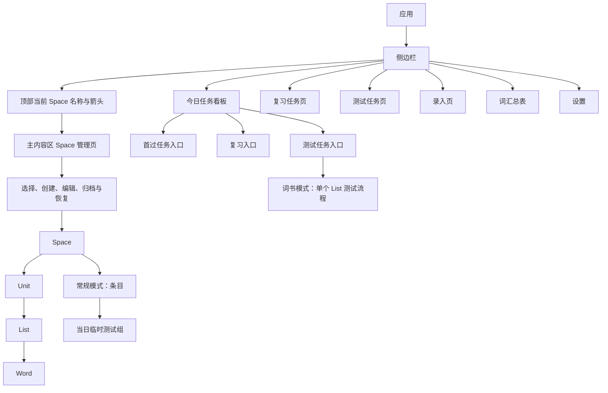

# Ebbinghaus 产品需求规格

## 1. 文档目的

本文档描述 Ebbinghaus 第一版的产品范围、用户流程、业务规则、数据要求与验收标准。调度公式和研究依据见 `docs/复习调度算法.md`；动态进度与待确认问题见根目录 `CLAUDE.md`。

本文不约束视觉表现：文中涉及颜色、图标、标记形式等视觉表述只表达“状态必须多通道、可辨识地呈现”的语义要求；具体配色、字体、间距、控件样式与深色模式属于界面设计层。v2 起视觉设计权限开放给设计执行方自主决策，约束力范围以 `docs/界面设计规格.md` 第 1 章为唯一口径。

## 2. 背景与目标

用户使用一本按词频分区、按 Unit 和 List 编排的纸质考研英语词书，总量约 6000 词。纸质书适合遮挡、勾画、朗读和快速翻阅，但不能自动提醒复习与测试。

纸质词书每个 List 固定包含 60 个单词。软件只录入用户在首过中筛出的重点 Word，不要求录入纸质 List 的全部 60 个单词。

用户当前粗略估计首过前已有认识率约为 60%–90%，但该估计尚未经过实际数据验证，并且可能只适用于必考词；常考词和偶考词的认识率可能明显不同。该估计只能用于早期容量分析和压力测试，不得作为调度规则、验收标准或跨 Space 的固定参数。第一版应按 Space 记录实际首过录入量、测试 Word 数量和完成耗时，供后续校准。

词书模式的目标不是复制通用背词软件，而是补齐纸质词书的四项能力：

1. 记录每个 List 首过后筛出的重点单词和重点中文义项。
2. 以 List 为单位在软件内提供线下复习的浏览入口，只提示今天关注哪些词，不记录复习行为。
3. 在软件内完成逐词主动回忆测试，并保存单词级掌握证据。
4. 根据每日容量、当前到期任务和未来压力，建议当天新增首过的 List 数。

## 3. 核心概念

| 概念 | 定义 |
| --- | --- |
| Space | 用户用于隔离不同学习范围的顶层容器；首次启动固定创建词书模式的必考词、常考词、偶考词，以及常规模式的日常积累，之后允许用户创建、重命名、归档和恢复 |
| 学习模式 | Space 创建时选择且之后不可修改的学习模型；取值只能是词书模式或常规模式 |
| 词书模式 | 保留 `Space → Unit → List → Word` 结构、List 接触曲线、纸质复习确认和长期验证的既有模式 |
| 常规模式 | 用于自由积累英文单词和短语的模式；没有 Unit 和 List，所有排期、测试结果、掌握信息和容量预测均以条目为单位，并使用自由间隔重复调度器（Free Spaced Repetition Scheduler，FSRS） |
| 条目 | 可录入任意英文单词或短语的学习对象；在词书模式中对应既有 Word，在常规模式中是排期、测试和掌握信息的最小单位 |
| 测试组 | 常规模式把当天按 Word 优先级重排后的到期条目按默认 20 个临时切分的展示组；仅用于当天测试与朗读浏览，不是调度对象，不具有跨日持久化标识、固定成员或完成状态 |
| 活动 Space | 用户当前正在浏览和操作的全局 Space 上下文；应用重启后恢复上次选择，所有业务页面自动继承，页面内不得重复要求选择 Space |
| Space 管理 | 在主内容区域完成 Space 选择、创建、重命名、归档、恢复和空 Space 删除的专用页面；入口固定在侧边栏顶部当前 Space 名称右侧的箭头 |
| Unit | 词书在 Space 下的一级编号分组 |
| List | 用户所有学习操作的最小可见单位；由 Space 与 Unit 下的 List 编号唯一定位 |
| Word | List 内录入的重点英文词条；短期通过次数、测试结果和掌握状态的内部最小单位 |
| 词性 | 用户手录中文义项可选携带的语法类别；携带时保存本规格定义的唯一规范简称，语音中的全称、口语或非标准简称必须先规范化；用户未表达词性时义项留空保存，不强制补选 |
| 结构化手录义项 | 一个词性、一个中文释义和一个可选用法字符串组成的不可拆分数据项；同一 Word 有多个义项时，每个义项分别保存并分别显示词性与用法 |
| 结构化候选 | 本地规则或大语言模型根据原始语音转写生成、已通过本地字段校验但尚未写入正式学习数据的 Word 与结构化手录义项集合 |
| 预览保存 | 用户查看结构化候选后在可编辑表单中直接一键保存，或先增删修改再保存；这是首过正式入库动作，不额外弹出普通确认对话框 |
| 活动 Word | 掌握状态为未掌握、仍需参与复习或测试调度的 Word |
| 首过 | 用户在线下遮挡释义、翻书筛选不认识的词或义项；软件只接收结果 |
| 复习 | 用户在线下不遮挡词书，朗读、背诵已勾画内容；软件只提供一个浏览入口，展示今天关注的词，不记录复习行为、不计量、无完成状态。复习页在两种学习模式下是同一类入口 |
| 到期复习词 | 按 Word 自身的复习计划（`T0 + 2` 或 `T1 + 1`）到期的活动 Word；只在到期日当天进入复习入口候选集，逾期后不再出现（不做逾期）；它只决定复习入口候选集，不产生任务、事件或工作量 |
| List 接触事件 | 用户对一个 List 发生的一次有效学习接触，类型只能是首过或测试；纸质复习不是软件可记录的事件 |
| 仅复习 | Word 复习计划到期的线下朗读需求；只影响复习入口的候选集，不产生任务、不计工作量、无完成状态 |
| 测试 | 软件显示英文词条供用户检查记忆，揭示答案后允许改判；最终结果用于更新 Word 状态 |
| 测试后复习 | 已废弃术语（2026-10-02 口径）：软件测试完成后的纸质复习不再是任务或事件，相关需求见"复习" |
| 短期通过次数 | 未掌握 Word 在短期同步阶段的状态，取值只能是 0、1、2 |
| 短期周期起点 | Word 最近一次进入短期通过次数 0 的日期，记为 `T0` |
| 短期通过次数 1 起点 | Word 最近一次达到短期通过次数 1 的日期，记为 `T1` |
| 等待校验起点 | Word 最近一次达到短期通过次数 2，或最近一次等待校验成功的日期，记为 `T2` |
| 等待校验 | 短期通过次数为 2 的 Word 等待满 7 个自然日后进行的状态校验 |
| 同步条件 | List 至少存在一个活动 Word，并且所有活动 Word 的短期通过次数均为 2 |
| 长期验证 | List 满足同步条件并停止复习 7 个自然日后，对全部未掌握 Word 进行的测试 |
| 掌握状态 | Word 是否通过长期验证的二值状态，只能是未掌握或已掌握 |
| 工作量 | 首过计 1，每次词测试最终判断计 1；纸质复习不计工作量；每日容量的计量单位 |
| 常规模式工作量 | 常规模式中录入一个条目计 1、确认测试一个条目计 1、朗读复习计 0；每日目标、实际完成量和新增建议均以条目数计 |
| 大语言模型智能整理 | 将语音输入法转写的原始文本发送给大语言模型（Large Language Model，LLM）应用程序编程接口（Application Programming Interface，API），转换为待校验的结构化词条、词性、中文义项和义项用法，并为各字段保留原文证据与警告 |
| 在线词典 | 通过网络查询并补充词条详情的外部数据来源；并发请求有道词典与维基词典，首个成功结果按优先级展示 |
| 学习日 | 按用户时区和可配置换日时间划分的学习日期，是跨日计数和每日任务的时间单位 |
| 每日容量 | 当前 Space 期望每天完成的首过与测试总工作量；各 Space 独立保存，切换 Space 时随之切换 |
| 到期任务 | 计划到期时间位于当前学习日内且尚未完成的测试任务 |
| 逾期任务 | 计划到期时间早于当前学习日且尚未完成的测试任务 |
| 积压任务 | 当前所有逾期测试任务的集合；不包含尚未到期的未来任务；复习入口无逾期与积压概念 |
| 累计认识次数 | 仅常规模式使用的条目历史计数；每次最终判断为认识时加 1，不认识不清零。它表示已经投入并成功巩固的次数，只用于积压排序，不改变 FSRS 记忆参数或掌握判定 |
| 最近一次最终判断 | 常规模式中该条目最近一次已确认的认识或不认识结果；用于识别刚发生遗忘的条目 |
| 最终判断 | 用户查看答案并完成两次操作后确认的“认识”或“不认识”；答案揭示后允许修正初判，只有最终判断写入调度器 |
| 点错了 | 逐词测试中初判“不认识”并揭示答案后，用户表示刚才误触该按钮；若还有其他待测内容，当前 Word 或条目只在本机测试会话中移到剩余待测队列末尾，暂不产生最终判断或学习事件，轮到它时重新从作答前测试。若它是最后一个待测内容，按钮不可用并按学习模式显示原因，避免点击后下一题仍是当前内容 |
| 测试会话 | 用户点进一个 List 测试后才形成的可持久化本机执行单元，记录待测 Word 顺序、已确认结果、当前位置和会话状态；仅在同一学习日内可恢复（退出、崩溃后可继续），换日（默认凌晨 04:00）后会话作废、不跨日恢复，未答 Word 并入次日任务调度；跨端确认结果以学习事件为准 |
| 录入草稿 | 正式保存前的本机编辑状态，包含原始输入、智能整理后的未提交结构化候选及用户对预览表单的编辑；不属于云端同步数据 |
| 掌握状态 | Word 的“未掌握”或“已掌握”状态。词书模式仅由长期验证结果改变；常规模式由 FSRS 排期结果派生。已掌握不等同于永久不会遗忘 |
| 手动不认识反馈 | 用户在词汇页对已掌握 Word 选择“标记为未掌握”，明确表达“我又不认识这个词了”。该反馈不是孤立字段编辑：词书模式按长期验证不认识的状态机提交，常规模式向 FSRS 提交一次 Again |
| 大语言模型服务配置 | 用户在全局设置中配置的唯一大语言模型服务连接，由基础地址、模型名称、API 密钥和思考开关四项组成；采用自带密钥（Bring Your Own Key）模式，不做供应商管理，不提供多套配置切换 |

## 4. 产品原则

- **纸书优先**：词书模式的首过与线下朗读复习继续在纸书中完成。
- **List 对外、Word 对内**：此原则只适用于词书模式；常规模式的任务、计划和测试证据都按条目处理。
- **活动 Word 决定频率**：List 中已掌握 Word 的比例只影响一次复习或测试所需时间；只要仍有活动 Word，既定的 List 复习排期就不因活动 Word 占比下降而取消或延后，测试排期仍由最早到期的活动 Word 决定。
- **统一接触曲线**：首过与测试来自同一条 List 接触曲线；仅复习日期只是复习入口的候选信号，不产生任务，也不维护割裂日历。
- **状态分离**：短期通过次数用于 List 同步；词书模式的掌握状态由长期验证或手动不认识反馈改变，常规模式的掌握状态由 FSRS 结果或手动不认识反馈改变；仅复习绝对不能改变二者。
- **长期无接触**：List 满足同步条件后停止全部纸质复习 7 个自然日，确保长期验证不受临近复习污染。
- **复习入口不泄露待测答案**：复习入口展示的候选词必须排除今日到期待测试且尚未测试的词，避免先看答案造成虚假熟悉。
- **积压优先保护已投入学习**：积压排序只改变默认展示与分组，绝不改写原计划日、T0/T1/T2、FSRS 到期日、测试历史或工作量；用户始终可以主动选择其他任务。
- **手录优先**：用户从词书录入的中文义项是主数据，在线词典不得覆盖或改写。
- **离线可用**：网络不可用时，录入、今日清单、测试、历史和手录释义仍能工作。
- **真实记账**：未完成就是未完成，系统不得自动补签或伪造历史。
- **算法可解释**：每项今日任务能说明为何到期，每个新增建议能说明容量如何计算。

## 5. 信息架构



- 应用始终存在一个全局活动 Space，默认恢复上次使用的 Space。侧边栏顶部直接显示活动 Space 名称，标题行右侧提供箭头；点击箭头后在主内容区域打开 Space 管理页，不使用临时下拉菜单，也不把入口埋入设置。
- Space 管理页显示全部未归档 Space，并提供选择、创建、重命名和归档入口；归档内容单独折叠展示并允许恢复。用户选择另一个 Space 后立即切换全局上下文、返回进入 Space 管理页之前的页面、刷新当前内容，并短暂提示“已切换到{Space 名称}”。
- 首次启动默认创建“必考词”“常考词”“偶考词”。用户可以创建任意名称的 Space；名称去除首尾空白后必须非空，并且不得与另一个未归档 Space 重名。
- 只有完全不含词书层级或条目、学习事件和每日计划的空 Space 才允许删除；删除前必须明确确认。非空 Space 只能归档，归档后不参与日常导航、任务生成和新增录入，但历史数据完整保留并可恢复。
- 归档当前活动 Space 前必须先切换到另一个未归档 Space；应用至少保留一个未归档 Space，不允许把最后一个可用 Space 归档或删除。
- 若另一终端归档了本机当前活动 Space，本机拉取该目录变更后自动改选按显示顺序排列的首个未归档 Space。活动 Space 选择仍只保存在本机，不作为同步设置推送；已归档 Space 的学习记录保持可恢复。
- 今日看板、首过、复习入口、测试和词汇总表均自动继承活动 Space 上下文，任何业务页面内不得再次要求用户选择 Space。
- 今日任务看板展示首过与测试两类任务卡片，并提供复习入口，点击卡片进入对应页面。
- 今日任务看板直接提供当前 Space 每日目标工作量的查看和修改入口，并同步展示已完成工作量、逾期工作量、今日到期工作量、建议新增首过 List 数和未来压力；该入口不属于全局设置页。
- 今日任务看板同时展示最近实际日均完成工作量，用于对照用户设置的每日目标工作量；统计窗口必须在容量前置实验中确定并写入算法版本。
- 首过任务页顶部展示“今天已完成首过 List 数 / 今天建议首过 List 数”，下方直接提供 Unit、List 和语音批量录入表单；Space 取自全局活动 Space，不显示重复选择字段。
- 复习页展示当前活动 Space 内今天关注词的浏览入口：词书模式按 List 分组展示候选词，常规模式按当天测试组展示已测条目；页面无任何完成、确认或推迟操作，页面不得重复显示或选择 Space。
- 测试任务列表页展示到期及逾期测试 List；点击 List 进入独立逐词测试流程。
- 所有跨学习日未完成任务必须在当前所属任务列表的 List 卡片层级以强调色突出，并同时显示“逾期”文字、状态图标和逾期天数；不得只依靠颜色传达状态。具体色值与强调形式由视觉设计决定，不要求整张卡片使用警示背景。
- 逾期任务默认排在未逾期任务之前，但不强制阻塞用户；用户可以自由选择其他 List 先执行。
- 未开始的软件测试与部分完成的软件测试都必须按照当前阶段在测试任务页显示逾期状态和完成进度；复习入口不显示逾期、到期或完成状态。
- 常规模式今日看板只把到期或逾期的条目测试视为待办；当日已测条目的朗读复习仅显示为可选入口，不显示为逾期、待完成或工作量。看板以条目显示建议录入数、已完成工作量和未来压力，不显示 Unit、List 或词书模式的仅复习信息。

## 6. 核心用户流程

### 6.1 每日工作流

1. 用户打开应用，恢复上次活动 Space，并在今日任务看板查看每日容量、逾期数量、任务进度和建议新增首过 List 数。
2. 用户根据清单完成今日到期的 List 测试；若有 List 同时到期测试与复习候选，先完成测试再看复习入口。
3. 用户根据需要打开复习入口，浏览今天关注的词，并在线下翻书完成纸质复习（软件不记录）。
4. 用户根据新增建议在线下首过新 List。
5. 用户在当前活动 Space 中选择 Unit 和 List 编号，通过 macOS 语音输入法把新标记的单词及重点释义输入批量文本框；首过流程不得再次要求选择 Space。
6. 系统默认先执行大语言模型智能整理，再执行本地校验并展示可编辑的结构化候选表单。
7. 用户执行预览保存后，系统保存数据、异步补充在线词典信息，并将新 List 纳入后续调度。

每日必须能够同时承载首过、线下复习和测试三类行为。项目启动首日若尚无历史 List，复习入口可以没有候选词；新 Word 的第一次短期测试固定安排在其 `T0 + 1 个自然日`。

### 6.2 新建 List 与批量录入

#### 表单

- Space：不在表单中重复显示或选择，直接继承侧边栏顶部的活动 Space；需要切换时通过 Space 管理页完成。
- Unit 编号：必填，正整数或由词书配置限定。
- List 编号：必填，在同一 Space 与 Unit 下唯一。
- 批量文本框：必填，兼容 macOS 语音输入法；原始输入可以包含语音转写产生的断句、同音词、标点和格式误差。
- 录入方式入口：默认进入大文本框智能整理；另提供“直接手动填写”，跳过大文本框和大语言模型，直接进入第二步结构化表单。

原始文本、智能整理得到但尚未保存的结构化候选，以及用户对第二步表单的未提交修改，均作为录入草稿仅在当前设备持久化和恢复。只有用户完成预览保存、正式入库的词条与义项才进入同步；另一设备的录入不锁定本设备草稿，远端已正式入库的词条在拉取完成后参与保存时的重复检查。

#### 输入自由度与词性规范

大文本框接受任意自由输入：用户可以粘贴语音转写原文，也可以直接输入单词的词性、释义与用法，不需要整理成任何固定格式。系统没有从大文本框直接做格式解析的路径，输入内容只能交给大语言模型整理，或由用户点击“直接手动填写”进入结构化表单。输入框内部不得保留任何格式示例或占位提示诱导用户按固定语法书写。

涉及词性时使用唯一的规范简称。词性唯一规范简称如下，界面、数据库、模型输出与测试不得使用表外别名作为正式值：

| 规范简称 | 正式词性 |
| --- | --- |
| `n.` | 名词 |
| `v.` | 动词 |
| `vt.` | 及物动词 |
| `vi.` | 不及物动词 |
| `a.` | 形容词 |
| `ad.` | 副词 |
| `prep.` | 介词 |
| `pron.` | 代词 |
| `conj.` | 连词 |
| `num.` | 数词 |
| `art.` | 冠词 |
| `aux.` | 助动词 |
| `modal.` | 情态动词 |
| `interj.` | 感叹词 |
| `det.` | 限定词 |

#### 规范化规则

1. 删除行首尾空白，忽略纯空行。
2. 英文词条保留合理的连字符、撇号和短语空格；用于去重的规范键统一大小写和连续空白。
3. 中文义项按中英文逗号、分号、顿号等候选分隔符切分，但括号内标注不得被拆散；每个拆分后的义项至多关联一个规范词性。手动填写时词性可以留空；智能整理时由模型尽量补全，并按证据节点规则标记推断或不确定性。
4. 去除空义项和完全重复义项，保留用户原始输入文本用于审计。
5. 同一批次内的重复词条合并义项前必须让用户确认；词条冲突与跨批次重复的处理规则见“提交后行为”。
6. 无法识别英文词条、缺少中文释义或分隔边界不确定的行显示行号和原因。
7. 提交前展示“原文—解析词条—词性—释义—用法—证据警告”预览，用户执行预览保存后才写入。
8. 预览保存支持直接一键保存，也支持先新增、修改、删除 Word 与结构化手录义项后再保存；普通首过保存不额外弹出确认对话框。
9. 首过预览与任意时间内容维护复用同一类 Word 编辑表单和结构化义项控件，字段语义、词性选项和校验规则必须一致。

#### 大语言模型智能整理

大语言模型智能整理是第一版必须实现的录入主路径，目的在于让用户在首过后直接朗读英文词条和重点中文义项，避免逐字键入。

词书模式与常规模式必须共用同一个录入入口、同一个智能整理应用用例、同一个 `entry-organizer-v3` 响应结构，以及同一种 Word／义项／用法编辑数据结构；不得按学习模式分别定义“词书智能整理”“常规智能整理”、模式专属整理结果或模式专属字段校验。Space 是两种模式共同的最外层数据隔离边界：两种模式都继承当前活动 Space，且都允许存在多个同模式 Space。只有词书模式在活动 Space 之下额外填写 Unit 和 List，并在确认保存后进入词书调度事务；Space、Unit 和 List 都不得进入大语言模型请求或证据树，Unit 和 List 也不得进入通用条目编辑结构。

大语言模型智能整理采用自带密钥模式，连接用户在全局设置中填写的兼容接口；设置页继续只展示基础地址、模型名称、API 密钥和“允许大语言模型思考”开关，不增加供应商选择控件。后台根据规范化后的基础地址识别内部供应商枚举，并无感选择该供应商所需的请求路径、请求体、请求头和响应解析差异；无法识别时使用通用 OpenAI 兼容路径。客户端由项目使用 Python 标准库直接实现最小 HTTP 请求、认证、网络错误转换和响应解析，不引入 OpenAI SDK、DeepSeek SDK、`requests`、`httpx` 或其他第三方 HTTP 依赖。整理请求不设置客户端主动超时；整理进行中主要操作变为“取消整理”，用户再次点击后关闭活动请求并保留原文。配置可依据提供方官方可用模型调整，但不得改变下述整理语义。

英文系统提示词与响应结构必须在 `infrastructure/llm` 中分别版本化；实际请求只发送英文系统提示词，中文版本仅作为等价审阅稿，不与英文版本同时发送。系统提示词必须内嵌完整证据树、JSON Schema 和关键示例，并满足以下约束：

- 只把用户原始语音转写整理为系统可解析的英文词条、词性、中文义项和义项用法结构；允许修正明显的语音转写错误，并必须在对应证据节点的可选 `warning` 中说明修正或不确定之处。用户明确说出英文词条但没有提供完整词性或释义时，模型可以依据常见用法补充常见词性和常见释义，但所有没有原文证据的补充都必须在对应节点填写 `warning`；除此以外不得凭空增加词条、义项、词组或例句。
- 词性属于每个 `meaning`，不是英文词条级字段。模型应尽量为每个义项补全可判断的词性；补全或不确定时必须在该词性证据节点提示，无法判断时保留 `null`。
- 模型响应本身不得直接入库，只有用户点击保存后才成为正式结构化手录义项；原始转写、证据片段和警告必须在预览中可核对。
- 只返回固定结构化数据；本地校验失败时不得把自由文本或部分结果直接写入正式数据。
- 提示词只包含本次原始文本、格式规则和响应结构，不包含活动 Space、Unit、List 或任何学习历史。
- 所有 `warning` 字符串（节点级警告与 `global_warning`）必须使用简体中文书写，禁止英文或其他语言；本地校验不因警告语言失败，但该要求必须写入系统提示词并由单元测试锁定。
- 原文已经明确提供的词条、词性、释义和用法必须填入对应节点的 `value`；`warning` 用于解释订正、补全或不确定性，不能替代字段内容，字段缺失不能只用警告交代。
- 明显错误必须实际订正；即使仍有部分不确定，也不能遗漏已经能够确定的信息。订正发生在 `value`；`source_excerpt` 必须保留原文字符，不得跟着 `value` 一起订正。
- 不得通过清空证据、删除义项、缩减内容、恢复错误值或编造证据来规避校验。
- 模型在返回结果前应在思考阶段核对原文明确提供的词条、各义项及用法是否完整进入相应字段；该核对不要求额外输出检查清单。核对对象是学习内容是否遗漏，不是标点或口头连接词是否被引用。
- 系统提示词内嵌的完整示例必须覆盖：词性位置出现明显错字（如“名次”）时，`value` 订正为规范词性、`source_excerpt` 保留原文错字、`warning` 挂在该词性节点说明订正（不得挂到释义节点）；以及释义仅存在标点形态差异（如原文半角逗号、整理值全角逗号）时，`value` 采用规范标点、`source_excerpt` 保留原文、不需要 `warning` 并直接通过。
- 系统提示词、JSON Schema 与本地校验规则必须同步维护、逐项对齐；不得存在模型完全遵守提示词却仍被本地隐藏规则拒绝的情况。

1. 用户从“智能整理”入口提交非空原始转写时，系统先保存当前原始文本草稿，再调用已配置的大语言模型 API；大文本框没有本地格式解析模式。
2. 请求只包含完成整理所需的原始文本、格式规则和结构化输出约束；不得上传 Space、Unit、List、学习历史或其他词汇数据。
3. 模型可以修正明显的语音转写错误；用户明确说出英文词条但缺少完整词性或释义时，可以补充该词条的常见词性和常见释义。每次修正、不确定判断和没有原文证据的补充都必须写入对应证据节点的可选 `warning`，由用户在预览中决定是否采用；不得生成用户没有说出的英文词条、词组或例句。
4. 同一英文词条可以包含多个中文释义；每个释义是用户表达的完整语义单位，可以由多个中文词组成，必须整体保留，不得按空格、字数或同义词结构拆分。用户重复说出词性、明确序号或明确说“另一个释义”时，表示新的 `meaning`，即使词性相同也不能拆成多个英文条目。
5. 词书模式与常规模式共用同一条目语义结构：一个英文词条包含多个 `meanings`，每个 `meaning` 保存词性、释义和可选的单个 `usage` 字符串；`usage` 必须属于对应义项，不得提升为词条级字段。两种模式仅在业务流程和任务归属上不同。
6. 模型输出必须符合统一的证据化 JSON 结构；每个英文词条、词性、释义和用法均为证据节点，节点同时保存整理值、用户原文片段和节点级警告。
7. 本地程序必须再次执行字段结构、证据片段、警告归属、去重和边界校验。只校验模型声明的非空 `source_excerpt` 是否确实存在于原文；相同原文片段允许同时作为多个字段的证据，重复出现本身合法，不维护“每处原文只能被引用一次”的消耗性定位规则，也不要求证据树顺序与原文顺序一致。证据定位只查找原文中真实存在的连续片段；同一片段存在多个出现位置时，能根据词条与释义上下文区分的优先使用对应位置，高亮区间允许重叠、合并与去重。对明显跨词条、跨义项的引用仍应指出实际出错节点；无法唯一定位不等于引用伪造。不要求证据覆盖整段原文，不计算或展示未覆盖片段，也不根据未覆盖内容生成警告。
8. 整理调用策略固定为：一次完整整理 → 本地规范化与质量检查 → 有问题时局部修复 → 合并后整批复验 → 进入步骤二。首次生成完整结果；本地校验按词条汇总全部可独立判断的问题（父结构已经损坏时不再制造派生错误），随后只让模型重新生成有问题的完整词条：修复请求包含完整原文、问题词条的上一轮输出、必要的相邻上下文和本轮错误清单，不累计重发多份完整 JSON；替换对象由客户端编号指定，模型不得顺带修改其他词条；合并时只替换问题词条，已通过内容保持不变，随后整批复验。单次解析提交最多进行 3 轮模型交互（包含首次生成），第二、三轮都是局部修复，不得无限重试；同一错误没有变化时，必须重新检查定位与修复指引，不得把同一条修复消息原样再发一次。所有轮次保持思考开启；提速只能来自更少的错误拒绝、更少的修复轮次和更小的修复请求，不得靠关闭思考、削减证据或漏填内容实现。
9. 同一次解析会话的自动修复耗尽 3 轮仍失败时，系统必须保留原始草稿与本次已整理成果、显示最终解析错误与仍未通过的问题清单，并提供“直接进入手动表单”和用户主动重新发起解析入口；不得把存在缺失或错误的结果伪装成完整成功进入步骤二。网络、鉴权、超时或服务端错误不属于解析修复轮次，按 API 失败路径处理。
10. 用户可以逐行编辑、拆分、合并或恢复原始内容；只有用户执行预览保存后才能保存 List。
   预览表单同时提供 Word 与结构化手录义项的新增、修改、删除和加载查看能力；点击“一键保存 List”即保存当前表单内容，不再增加与内容无关的确认步骤。
11. API 网络失败、返回格式错误或未配置时，保留原始草稿并明确显示原因；整理进行中用户可主动取消，取消必须立即关闭当前 HTTP 请求并让界面回到第一步，不能等待后台线程收尾；旧请求晚到的结果必须丢弃，不得生成“解析失败”草稿或污染用户随后发起的新请求；失败或取消后允许立即重试或直接进入手动表单。其中“返回格式错误”先按第 8、9 条执行同一会话内自动修复，修复轮次耗尽后再进入失败回退；客户端不得以固定时长主动终止整理请求。
12. 手动录入必须直接进入第二步结构化表单并提供空白条目，不显示大文本框、不调用大语言模型，也不再提供按规范文本语法解析大文本框内容的通路。
13. 相同原始文本的重试不得重复创建 List 或词条；写入操作必须保持幂等。
14. API 提供方、模型、提示模板和结构版本必须记录在解析审计信息中，但密钥不得写入解析审计信息、日志、文档、测试夹具或版本控制；密钥按第 6.9 节对称加密后存入数据库的用户配置表，明文不持久化。

解析修复轮次追加的用户消息使用以下语义，不创建新的独立整理会话；修复以完整词条为最小单位，只重新生成被客户端编号指定的问题词条：

```text
本地校验在本次整理结果中发现以下问题（按词条分组，每条注明客户端编号与所属词条）：

词条 {entry_index}（{term}）：
- {error_category}：{node_path} — {problem_description}
  你上一轮在该节点写出的内容：{offending_node_json}

{targeted_hint}

请基于同一段原始输入，只重新生成上述编号词条的完整词条对象（含该词条的全部义项），
不要改动其他词条；不得通过清空证据、删除义项、缩减内容或撤销正确订正来规避校验。
不要解释原因，不要返回 Markdown，不要增加 Schema 未定义的字段。
```

本地校验错误必须分类准确，不得把不同原因混成一句话；至少区分四类：引用文本在原文中不存在；引用与当前字段的上下文明显不对应（如跨词条、跨义项引用）；实质订正缺少同节点说明；必要内容或结构缺失。`{offending_node_json}` 回显完整问题节点及其所属词条上下文（只发回模型，不写入日志、不展示给用户；不得包含 API 密钥、个人路径、完整堆栈或其他敏感信息）。`{targeted_hint}` 按错误分类给出合规出路：`source_excerpt` 必须逐字摘自原始转写；发生实质订正时在同一节点 `warning` 中说明（警告用于记录改动，不代表要放弃订正）；无原文依据的模型补充内容必须写 `warning`。不再提供“把 `value` 改回原文即可”这类通用退路——明显错误必须实际订正，订正与同节点 `warning` 同时存在是合规结果。

#### 统一证据树与警告归属

词书模式和常规模式的模型整理使用同一套语义树。响应层可以因接口兼容保留不同的外层名称，但不得改变下列层级：

```text
整理响应
├── global_warning                   # 全局警告字段，可为空
└── entries                          # 英文词条数组
    └── entry                        # 一个英文单词或短语及其多个义项
        ├── term                     # 英文词条证据节点
        │   ├── value                # 整理后的词条
        │   ├── source_excerpt       # 用户原文连续片段
        │   └── warning?             # 可选的节点级警告
        └── meanings                 # 同一词条的多个义项
            └── meaning
                ├── part_of_speech   # 词性证据节点，value 可为 null
                │   ├── value
                │   ├── source_excerpt
                │   └── warning?     # 可选的节点级警告
                ├── definition       # 中文释义证据节点，补全时 source_excerpt 可为 null
                │   ├── value
                │   ├── source_excerpt
                │   └── warning?     # 可选的节点级警告
                └── usage            # 可选的用法/例句证据节点
                    ├── value
                    ├── source_excerpt
                    └── warning?     # 可选的节点级警告
```

`term`、`part_of_speech`、`definition` 和非空 `usage` 都必须是证据节点。每个证据节点包含 `value` 和 `source_excerpt`，并可选包含一个 `warning` 字段：

- `value`：模型整理后的值。明显转写错误可以被修正，修正后的值不要求逐字等于原文。
- `source_excerpt`：用户原文中的连续片段；英文词条和用户说出的非空 usage 必须提供。模型补全的词性或释义没有用户原文依据时，对应节点的 `source_excerpt` 为 `null`，并且同节点 `warning` 不得省略。`source_excerpt: null` 只用于确实没有直接原文依据的情况；不得因为引用定位困难，就把原文已经明确说出的内容改称模型补全。
- `warning`：节点级警告文本；仅在节点被纠正、模型补全词性、存在歧义或无法确认时填写，没有问题时省略该字段。它是证据节点的附属字段，不是独立的警告列表。

词性判断遵循以下规则：

1. 词性始终属于某一个 `meaning`，不能把一个词条的词性写到 `term` 层。
2. 用户重复说词性，或说“一、二”“第一、第二”“另一个释义”等，表示新的 `meaning`；即使词性相同也不能拆成新的英文词条。
3. 用户只说一次词性并连续说出一个由多个中文词组成的完整释义时，仍是一个 `meaning`；不得把中文近义词或并列词机械拆开。模型只依据用户重复词性、明确序号或“另一个释义”等显式边界建立多个 `meanings`，不在系统提示词中要求模型自行猜测没有标记的义项边界。
4. 同一英文词条中只要用户表达过与词性有关的信息，模型就应在能够保证正确性的前提下尽量补全各义项词性；没有直接原文证据的补全必须填写节点级 `warning`，且该节点的 `source_excerpt` 为 `null`。如果整段关于该英文词条的录音都没有涉及词性，模型可以保留空词性；无法可靠判断时将 `value` 和 `source_excerpt` 设为 `null`，并在该节点的 `warning` 中说明。
5. 用户明确说出英文词条但没有提供释义时，模型可以补充最常见的规范词性和常见中文释义。补充释义的 `definition.source_excerpt` 必须为 `null`，且 `definition.warning` 必须明确说明该释义并非来自用户原文；补充词性遵循上一条规则。

例如，用户说“`distinction`，名词，差别区分，名词，荣誉”，结果应是一个 `term` 和两个 `meanings`，两个义项分别携带 `n.`，不能按“差别”“区分”拆分，也不能生成两个英文条目。用户说“`conjunction`，名词，同时发生，`in conjunction with`，Guilt emerges in conjunction with a child's growing grasp of moral norms”，词组和例句应共同记录在该义项的 `usage` 中，而不是另建条目或提升到 `term` 层。

`usage` 是对应 `meaning` 下的单个可选字符串，不是 `term` 级字段。用户说出的词组、例句或其他用法原文统一放入所属义项的 `usage.value`，其原文依据放入同一节点的 `source_excerpt`；JSON 字符串允许使用换行转义符，并允许用空行分隔同一义项中的多组内容。词组、英文例句和中文翻译按出现顺序组织。如果包含英文例句，模型默认在 `usage.value` 中追加简洁中文翻译，但不得伪造用户未说出的词组或例句，翻译不计入 `source_excerpt`。自动补充中文翻译属于用户预先授权的派生内容，不能仅因增加了翻译而填写 `usage.warning`；只有对用户说出的用法发生修正、推断、歧义处理或无法忠实对应原文时才填写该节点警告。没有用法时 `usage` 为 `null`。

模型不输出 `unresolved_fragments`，本地程序也不计算未覆盖片段。证据校验只验证模型主动声明的非空 `source_excerpt` 是否能够在原文中定位；原文中没有被证据引用的其他内容不显示、不报警，也不阻止进入预览。

#### 本地校验与规范化口径

本地校验把「格式规范化」与「实质内容订正」分开：原文证据始终要求精确匹配原文字符；判断节点是否必须携带订正 `warning` 时，先对 `value` 与证据应用字段对应的有限规范化规则再比较。

| 情况 | 是否要求订正 `warning` |
| --- | --- |
| 中文释义中 `,` 与 `，` 等明确等价的标点形态差异 | 不要求 |
| 大小写、首尾与连续空白等格式整理 | 不要求 |
| `noun`、`名词`、`n` 等有效词性别名规范为 `n.` 等正式简称 | 不要求 |
| 将词性位置的错字（如“名次”）订正为名词 | 要求 |
| 修改英文拼写、中文错字或实际含义 | 要求 |
| 补充原文没有提供的词性或释义 | 要求 |

- 规范化规则必须有限、明确、逐条列举；不得通过“删除所有标点”或模糊匹配掩盖实质变化。错字（如“名次”）不得加入词性别名表，其含义由模型结合上下文判断，并以订正加 `warning` 的方式表达。
- `warning` 缺失、空字符串或 `null` 统一视为“无警告”，不因表示形式失败；确实需要说明的节点仍必须提供有效的简体中文说明，不得静默放行。
- 模型写出的有效词性别名先本地规范化为正式简称，不因未使用规范简称而判整批失败；可选用法为空等表示差异（如空字符串与 `null`）由本地统一处理。
- 原文证据不存在、实质订正未在同节点说明、原文明示内容缺失，仍属于必须修复的问题；校验不得简单删除 `value` 与证据之间的比对，只修正其对“格式变化”和“内容变化”的错误分类。
- 本地校验按词条汇总问题并分类报告；错误分类至少包括：引用文本在原文中不存在、引用与当前字段上下文明显不对应、实质订正缺少同节点说明、必要内容或结构缺失。

展示顺序和警告呈现必须保持归属清晰：

1. 智能整理进入结构化表单页后，原始转写卡片默认处于折叠状态，只显示一行原文摘要；用户主动展开后才显示本轮完整原文。模型声明为 `source_excerpt` 的所有证据只在该原文中集中高亮，不在英文词条、词性、释义或 `usage` 节点旁重复展示证据文本、证据标签或定位控件，也不展示未覆盖片段。
2. 按条目展示 `term`、多个 `meanings` 及其 `usage`；某个节点存在 `warning` 时，只在对应层级节点展示该 warning。没有 warning 的节点不显示空白警告区域。
3. 非空的顶层 `global_warning` 显示在整个预览内容的最下方，不放在顶部，也不并入任何字段节点。
4. 警告只属于本轮整理预览和审计，不直接写入正式 Word/义项的学习内容字段。

#### 统一响应 JSON Schema

以下为词书模式和常规模式共用的模型响应契约。两种模式不得再分别定义一套条目、义项、用法和证据字段；如外层调用代码需要不同命名，必须在组合根做无损转换，不能改变该树状语义。

```json
{
  "$schema": "https://json-schema.org/draft/2020-12/schema",
  "$id": "ebbinghaus-entry-organizer-v3",
  "type": "object",
  "additionalProperties": false,
  "required": ["schema_version", "global_warning", "entries"],
  "properties": {
    "schema_version": {
      "const": "entry-organizer-v3"
    },
    "global_warning": {
      "oneOf": [
        {
          "type": "string",
          "minLength": 1
        },
        {
          "type": "null"
        }
      ]
    },
    "entries": {
      "type": "array",
      "items": {
        "$ref": "#/$defs/entry"
      }
    }
  },
  "$defs": {
    "source_evidence": {
      "type": "object",
      "additionalProperties": false,
      "required": ["value", "source_excerpt"],
      "properties": {
        "value": {
          "type": "string",
          "minLength": 1
        },
        "source_excerpt": {
          "type": "string",
          "minLength": 1
        },
        "warning": {
          "type": "string",
          "minLength": 1
        }
      }
    },
    "definition_evidence": {
      "type": "object",
      "additionalProperties": false,
      "required": ["value", "source_excerpt"],
      "properties": {
        "value": {
          "type": "string",
          "minLength": 1
        },
        "source_excerpt": {
          "oneOf": [
            {
              "type": "string",
              "minLength": 1
            },
            {
              "type": "null"
            }
          ]
        },
        "warning": {
          "type": "string",
          "minLength": 1
        }
      },
      "allOf": [
        {
          "if": {
            "properties": {
              "source_excerpt": {
                "type": "null"
              }
            }
          },
          "then": {
            "properties": {
              "warning": {
                "type": "string",
                "minLength": 1
              }
            },
            "required": ["warning"]
          }
        }
      ]
    },
    "part_of_speech_evidence": {
      "type": "object",
      "additionalProperties": false,
      "required": ["value", "source_excerpt"],
      "properties": {
        "value": {
          "oneOf": [
            {
              "type": "string",
              "enum": ["n.", "v.", "vt.", "vi.", "a.", "ad.", "prep.", "pron.", "conj.", "num.", "art.", "aux.", "modal.", "interj.", "det."]
            },
            {
              "type": "null"
            }
          ]
        },
        "source_excerpt": {
          "oneOf": [
            {
              "type": "string",
              "minLength": 1
            },
            {
              "type": "null"
            }
          ]
        },
        "warning": {
          "type": "string",
          "minLength": 1
        }
      },
      "allOf": [
        {
          "if": {
            "properties": {
              "value": {
                "type": "null"
              }
            }
          },
          "then": {
            "properties": {
              "warning": {
                "type": "string",
                "minLength": 1
              }
            },
            "required": ["warning"]
          }
        },
        {
          "if": {
            "properties": {
              "source_excerpt": {
                "type": "null"
              }
            }
          },
          "then": {
            "properties": {
              "warning": {
                "type": "string",
                "minLength": 1
              }
            },
            "required": ["warning"]
          }
        }
      ]
    },
    "meaning": {
      "type": "object",
      "additionalProperties": false,
      "required": ["part_of_speech", "definition", "usage"],
      "properties": {
        "part_of_speech": {
          "$ref": "#/$defs/part_of_speech_evidence"
        },
        "definition": {
          "$ref": "#/$defs/definition_evidence"
        },
        "usage": {
          "oneOf": [
            {
              "type": "null"
            },
            {
              "$ref": "#/$defs/source_evidence"
            }
          ]
        }
      }
    },
    "entry": {
      "type": "object",
      "additionalProperties": false,
      "required": ["term", "meanings"],
      "properties": {
        "term": {
          "$ref": "#/$defs/source_evidence"
        },
        "meanings": {
          "type": "array",
          "minItems": 1,
          "items": {
            "$ref": "#/$defs/meaning"
          }
        }
      }
    }
  }
}
```

约束说明：

- `term.value`、有原文依据的 `definition.value` 和非空 `usage.value` 可以是明显转写错误的修正结果；对应非空 `source_excerpt` 必须仍是用户原文中的连续片段，且节点的可选 `warning` 必须说明修正内容。
- 用户明确说出英文词条但没有提供释义时，模型可以补充常见释义；此时 `definition.source_excerpt` 必须为 `null`，且同节点 `warning` 必须说明该内容由模型补充。没有 `warning` 的空释义证据不得通过校验。
- `usage.value` 可以在保留用户说出的词组和例句的基础上追加模型生成的简洁中文翻译；该翻译不是用户原文证据，`usage.source_excerpt` 只覆盖用户说出的原文。自动翻译是预先授权的派生内容，不能仅因增加翻译而填写 `usage.warning`；模型仍不得生成用户未提供的词组或例句。
- 用户明确说出的词性使用带原文依据的证据节点；模型补全的词性使用 `source_excerpt: null`，并且该节点的 `warning` 不得省略。无法判断时仍保留 `part_of_speech` 证据节点，将其 `value` 和 `source_excerpt` 设为 `null`，并在该节点的 `warning` 中说明。
- 顶层 `global_warning` 只记录无法归属到某个证据节点的整体问题；字段级问题必须写在对应证据节点的可选 `warning` 中，禁止把字段级 warning 拼成一段普通文本。
- 模型不输出 `unresolved_fragments`，本地程序不计算证据覆盖率，也不把未被引用的原文片段转成 `global_warning`。本地只校验模型声明的非空 `source_excerpt` 是否真实存在于原文；同一原文片段可被多个节点重复引用，不维护消耗性定位规则。

#### 语音输入容错重点

- 英文字母拼写与英文单词语音识别可能混淆时，模型可以修正明显错误；修正后的英文词条或词性必须在对应证据节点标记 warning，用户在预览中确认。
- “逗号、分号、句号、下一个”等口述标点或控制词，应结合上下文转换为分隔结构，但原始文本必须保留。
- 中文同音词修正允许作为候选，但必须在对应释义证据节点标记 warning，不能无提示覆盖原始义项。
- 模型不得根据自己的词典知识擅自补充用户没有朗读的义项；只能在用户已经表达的词条和义项范围内补全缺失词性。
- 多词短语、专有名词、连字符和撇号必须进入本地词条格式校验。

#### 提交后行为

- 原子保存整个 List：任何一行阻塞性错误都不得产生半个 List。
- 创建首过事件和初始调度状态。
- 在线词典查询异步进行；有道词典与维基词典并发请求，首个成功结果即展示并取消其余。每个数据源在适配器内部对超时或连接失败自行重试 3 次（共 4 次请求），响应结构错误或用户取消不重试。全部数据源都失败后才显示失败状态与手动重试入口，且不得回滚录入。
- 词书模式允许对同一 Unit 的同一 List 不止录入一次：List 编号已存在时不再阻止保存，而是复用既有 List 追加词条，List 的首次首过时间保持不变，新词条从本次录入时间开始自己的短期周期与调度状态；每次保存仍记录一条首过事件与 1 个工作量。
- 保存时以规范键（统一大小写与连续空白的英文词条键）检测本次确认条目与目标 List 已有词条的冲突。存在冲突时在写入前弹出冲突处理对话框，逐条列出冲突词条并让用户独立选择：「从 List 中删除」——软移除 List 中已有的旧条目（历史与审计保留，等同内容维护移除），然后录入本次新词条；「本次不录入」——保留旧条目，跳过本次冲突词条。冲突较多时支持逐项勾选、多选、全选和对选中项批量选择同一种处理方式；处理决定可在提交前修改，并持续显示已处理数量。全部冲突决定完毕后，由用户明确点击「确认处理并保存」才执行原子保存；此前按钮不可用。取消对话框则整体返回步骤二，不产生任何写入。
- 跨 List 出现同一词条是合法情况：词书模式不检测、不提示不同 Unit 或不同 List 之间的重复，也不自动合并它们的学习状态。
- 首过表单不得借冲突处理重新要求选择 Space。

### 6.3 List 内容维护

- 每个 List 的详情页必须提供 Word 内容维护入口，支持新增 Word、修改 Word 内容以及从当前 List 移除 Word。
- 可修改内容包括英文词条和用户手录中文义项；修改前展示原内容，保存前提供明确确认。
- 内容维护界面不得提供短期通过次数、掌握状态、预测模型参数、下次测试日期或历史测试结果的手动编辑入口。
- 只有尚未满足同步条件的 List 才能新增 Word。List 一旦满足同步条件，新增 Word 功能立即上锁；长期验证成功或失败都不得解除该新增锁。
- 向尚未同步的既有 List 新增 Word 时，为该 Word 创建短期通过次数 0 和新的 `T0`，从 `T0 + 1 个自然日`开始参加测试排期；不得复制同 List 其他 Word 的记忆状态。
- 修改既有 Word 的拼写或手录义项时，只更新内容字段，不得顺带重置、增加或降低其记忆状态。
- 英文词条、短语、拼写、大小写和空格的任何修改都属于同一 Word 的内容编辑，但它是危险操作：用户必须连续完成两次明确确认。确认后仍保留同一对象标识、全部学习历史、短期通过次数、掌握状态和下一次测试日期，不得创建“替换”流程、重置学习状态或把旧历史隐藏为另一个对象。
- 从 List 移除 Word 前必须进行两次明确确认。确认后，该 Word 及其专属测试历史和记忆状态不再提供查看、恢复或回退功能。本条约束内容维护入口；词汇总表的删除交互按第 6.6 节执行（列表态滑动删除无二次确认，详情删除使用确认/取消两按钮），最终都复用同一条软移除用例。
- 被移除的英文词条以后重新加入时，必须作为新 Word 从短期通过次数 0 开始，不恢复、不关联此前状态。
- 一次维护操作只影响明确选中的 Word；不得因为 List 内容变化而重置其他 Word 或整个 List 的学习进度。
- 修改后重新计算 List 的活动 Word 数量与聚合状态，但不得伪造复习完成或测试结果。

### 6.3.1 空 List

- 首过后没有任何重点 Word 时，允许保存空 List。
- 空 List 的首过仍计 1 个工作量，并记录首过完成事件。
- 空 List 不产生复习候选、等待校验或长期验证。

### 6.4 复习清单

复习页是两种学习模式统一的**浏览入口**：只展示今天关注的词，方便用户在线下翻书朗读。它不提供"完成""确认""推迟"或任何操作按钮，不生成学习事件，不计工作量，不显示逾期、到期或完成状态；打开、展开、收起和关闭页面都不产生任何数据写入。

- 词书模式复习页按 List 分组展示候选词，每组一张 List 卡，显示 `Unit / List` 与候选词数量；页面不得重复显示或选择 Space。
- List 卡的候选词集合 = 当日到期的仅复习词 ∪ 今天完成测试的词。两部分释义如下：
  - "当日到期的仅复习词"：复习计划日（`T0 + 2` 或 `T1 + 1`）等于当前学习日的活动 Word；仅复习日期逾期后不再出现在候选集，不做逾期累积，直到状态推进生成新的仅复习日期；
  - "今天完成测试的词"：当前学习日内已有最终测试答案的活动 Word（含短期测试、等待校验和长期验证；逾期测试任务在今天完成同样计入）；
  - 当日到期待测试且尚未测试的词不进入候选集，防止复习入口泄露待测答案。
- 候选词只包含活动且未掌握的 Word；同一 Word 的多项需求只计一次；已掌握或已移除 Word 不进入候选集。
- 候选词只是线下朗读提示，不提供逐词勾选；软件不再记录纸质复习是否发生。
- List 卡的展开与收起：点击 List 卡主体展开词列表，再次点击收起；展开区域内部可滚动，最大高度为 20 个词卡片，候选词不足 20 个时按实际数量展示，宽度与 List 卡一致并保留左侧小缩进。
- 词卡片只展示两列内容：左侧英文词条（左对齐），右侧释义（右对齐）；释义含用法，按每个词性条目的顺序直接展示；释义区域横向放不下时允许左右滚动。词卡片不显示 Unit、List、掌握状态等其他信息，不提供任何按钮，不使用词汇页式侧边栏。
- 复习入口不随学习日产生任何待办语义：次日重新计算候选集，前一日浏览内容不作为任务保留，也不存在"未完成复习"。候选集是纯派生只读视图，不持久化、不同步，由学习事件确定性重放实时计算。
- 学习模式只决定分组单位：词书模式按 List 分组，常规模式按当天测试组分组（见第 6.8 节）。

### 6.5 测试清单与逐词测试

#### List 入口

- 今日页只展示到期的测试 List，不直接散列单词。
- 开始或继续测试只允许因"该 List 当前没有到期测试需求"而不可用；不得因本机存在其他会话、会话绑定其他任务或任何内部执行状态拒绝用户进入测试。一天未测完的 List，已答 Word 的结果保留，未答 Word 在次日任务中继续可测。
- List 卡片展示本次待测词数、未掌握词总数、已掌握词数和逾期程度。
- 进入一个 List 后，只测试本次已到期且未掌握的单词；同一 List 的未到期词不提前混入。

#### 单词测试

1. 初始只显示英文词条，不显示任何中文或在线释义，并提供“认识”和“不认识”两个按钮。
2. 答案揭示前，`Enter` 等价于“认识”，`Backspace` 等价于“不认识”。
3. 用户选择后，系统揭示手录词书义项；已有在线补充释义时必须同时直接展示，不要求用户再次点击展开。查询中、成功、缓存和更新时间不显示为用户状态；只有联网失败且没有可用在线内容时才显示失败提示与重试入口。
4. 初判为“认识”时，答案页显示“下一个词”和“标记为忘记”两个按钮；`Enter` 等价于“下一个词”，`Backspace` 等价于“标记为忘记”。
5. 初判为“不认识”时，系统揭示答案；答案页以“确认不认识，下一个”为主操作，点击它或按 `Enter` 时立即确认最终“不认识”并进入下一个词。答案页另提供尺寸更小的“点错了”按钮：只要还有其他待测词，点击后仅将当前词移至本机测试会话剩余待测队列的末尾，立即显示另一个待测词并清除本次初判，不写测试结果、调度变化或出站同步事件；轮到该词时重新从未揭晓状态测试。若当前词是最后一个待测词，按钮不可用，并显示“这是最后一个待测词，没有下一词可先测。”，避免点击后仍展示当前词。“点错了”不分配键盘快捷键，移动端放在答案页最下方，与主操作拉开距离。`Backspace` 仍只表达“不认识／标记为忘记”。
6. 快捷键只在测试界面获得焦点且用户不处于文本输入状态时生效，必须拦截系统返回导航等默认行为。
7. 初判为“认识”时，“下一个词”或 `Enter` 提交最终“认识”并进入下一词；“标记为忘记”或 `Backspace` 直接确认最终“不认识”并进入下一词。初判为“不认识”时，第二次操作可确认“不认识”，也可通过“点错了”将当前词暂缓到队尾；暂缓的词在重新出现前不算已完成。一次正常作答只需两次操作，不要求第三次确认。
8. 整个软件测试结束后，应用展示有成就感的完成反馈，并显示今天剩余测试工作量；反馈提供“去复习”与“继续测试”两个按钮，前者跳转复习入口，后者返回测试列表。没有待测 List 或待测组时，“继续测试”改为“完成测试”，返回空的测试列表。该反馈只是提示，无完成确认、无事件、无工作量。
9. 退出未完成测试时保留已确认词的结果，未确认词不产生测试记录；再次进入继续剩余词。
10. 每个已确认 Word 的结果、真实测试时间、状态变化和会话进度立即持久化；应用退出、崩溃后在同一学习日内可恢复，换日后不恢复，未答 Word 并入次日任务。“点错了”造成的本机队列顺序调整也必须保存，并在暂停恢复后保留；它不改写 Word 计划或产生同步事件。
11. 部分完成的软件测试不计入已完成工作量；每个已确认 Word 的最终测试判断计 1 个工作量。全部待测 Word 完成后，该 List 测试任务即完成；纸质复习是否进行完全由用户在线下决定，软件不感知。

#### 短期同步与掌握规则

- 新 Word 的短期通过次数为 0，首过确认日期为 `T0`。
- 第一次短期测试安排在 `T0 + 1 个自然日`；认识使 0 变为 1，不认识保持 0 并以失败当天生成新的 `T0`。
- 仅复习安排在 `T0 + 2 个自然日`，不改变任何 Word 状态。
- 第二次短期测试安排在 `T0 + 4 个自然日`；认识使 1 变为 2，不认识重置为 0 并生成新的 `T0`。
- Word 正常完成 `0→1` 时，以测试当天生成新的 `T1`；原有 `T0 + 2` 仅复习和 `T0 + 4` 晋级测试分别等价于 `T1 + 1` 和 `T1 + 3`，不得重复生成任务。
- 短期通过次数为 2 的 Word 从其 `T2` 起等待 7 个自然日仍未随 List 同步时参加等待校验；该间隔绝不从 `T0` 起算。认识保持 2 并以校验当天刷新 `T2`；失败只降为 1，以校验当天生成新的 `T1`，随后统一安排 `T1 + 1` 仅复习和 `T1 + 3` 晋级测试。
- List 至少存在一个活动 Word，并且所有活动 Word 的短期通过次数均为 2 时满足同步条件，随后停止复习 7 个自然日；空 List 不满足同步条件。
- 长期验证认识使 Word 变为已掌握；不认识使短期通过次数重置为 0并进入新周期。
- 每个测试会话对同一 Word 最多产生一次最终结果，不允许通过返回重复作答改变状态。
- 测试会话保存待测 Word 顺序和本机已确认位置，用于崩溃、暂停及当日恢复；它不是覆盖云端学习事件的权威进度，不跨学习日恢复。另一终端对同一任务的 Word 完成第二步确认并同步到本机后，本机开放会话须按已确认事件跳过该 Word，任务行与当前测试卡片就地更新，不要求退出、重启或手点同步。当前卡片若只做了第一步初判、尚未确认，则丢弃这份未提交的临时判断并展示合并后的当前 Word；不得代替用户产生答案事件，也不得把页面送回任务列表。确认按钮必须核对用户正在作答的 Word 与持久会话当前 Word 一致，防止拉取与点击交错时把旧判断记到下一词。录入草稿不使用测试会话的执行位置语义。
- List 中全部 Word 均已掌握后，List 状态变为已掌握并退出常规调度。

### 6.6 词汇总表

- 先按 Space 隔离，再支持按 Unit、List、掌握状态筛选；筛选面板最右端提供搜索框，输入即实时搜索，不需要确认按钮，按前缀或模糊方式同时匹配英文词条和中文释义，并与 Unit、List、掌握状态筛选组合生效，两种模式通用。
- 默认使用占满主内容区的单列 Word 卡片，纵向排列。未掌握 Word 固定排在已掌握 Word 前；同一掌握状态内按 Word 录入顺序倒序展示，同批录入时保持用户保存时的顺序。
- 默认卡片第一行左侧展示英文词条、右侧展示手录义项，第二行展示所属 Unit/List、录入日期和掌握状态；已掌握状态必须以清晰但低干扰的视觉标记体现；不得默认展开或常驻详情。
- 点击整张 Word 卡片后从主内容区右侧滑出详情检查器，不通过鼠标悬停触发。详情打开时左侧列表保留原滚动位置并收窄，每张卡片重排为英文、释义、所属位置与状态三行；收起详情后恢复全宽卡片。详情检查器只通过“收起”按钮关闭，不因点击详情外其他区域自动收起。
- 掌握标记是双向手动操作，均不需要二次确认：未掌握 Word 的全宽卡片在释义文本左侧显示“标记为已掌握”，已掌握 Word 显示“标记为未掌握”；按钮跟随释义排版，不要求跨卡片纵向对齐。详情打开后，列表卡片不再显示该操作，改由详情检查器提供与“删除词条”同一行右侧的同名入口。语义见第 6.8 节：词书模式标记已掌握是用户声明的硬掌握终态，标记未掌握重置短期周期；常规模式双向标记只改掌握标记，FSRS 照常调度并保持可逆。
- 列表态删除采用滑动删除：Word 卡片可以向右拖动，左侧露出红底删除按钮，点击按钮立即提交软移除，不需要二次确认；处于滑出状态时，任何没有点中删除按钮的鼠标点击都让卡片滑回原位，等于取消删除。展开态卡片不响应滑动，删除改由详情检查器承担。详情检查器的“删除词条”按钮点击一次后分裂为“确认删除”和“取消”两个按钮：确认才提交软移除，取消、切换词条或收起详情时撤销未完成的确认。两处删除都复用 List 内容维护的软移除用例：词条立即从所属 List（常规模式为所属 Space）的查询中隐藏，不可变事件与测试历史保留用于审计，不提供查看、恢复或回退入口；删除后列表与详情立即刷新。
- 筛选与词条列表、详情检查器完全解耦：筛选或搜索变化只过滤列表；当前选中词条仍在结果中时保持其选中状态与详情打开，被过滤掉时才清除选中并自动收起详情。
- 右侧详情显示：
  - 完整手录义项；
  - 在线补充释义；
  - 短期同步进度与掌握状态；
  - 最近测试结果、下次测试日期；
  - 人类可读的学习记录。
- 详情中的手录义项和在线补充释义必须按义项换行。在线详情并发请求有道词典与维基词典；有内容时直接展示内容，不显示查询中、成功、缓存、来源、更新时间、无结果或过期状态。
- 若没有在线中文释义则不渲染空区块；只有联网失败且没有可用缓存内容时，才显示失败提示和重试入口。
- 在线内容必须放在标题为“在线词典”的独立区块中，禁止与手录义项混成无法辨别的一段文本；区块标题用于区分内容来源，不额外展示词典提供方或查询状态。

### 6.7 每日容量与新增建议

- 用户在当前 Space 的今日任务看板设置每日目标工作量；目标按 Space 独立保存，首过计 1，每次词测试最终判断计 1，纸质复习不计工作量。全局设置页不得展示或修改每日目标。
- 首过计入每日容量，工作量为 1。
- 系统同时记录实际测试词数和耗时，为后续把容量换算得更准确提供数据。
- 今日页展示：目标容量、到期工作量、逾期工作量、预计剩余容量、建议新增 List 数和未来 21 天压力预览。
- 目标容量是软上限。若逾期和到期任务已经超出容量，仍完整展示任务，不隐藏超额部分。
- 新增建议算法、优先级和积压任务处理见 `docs/复习调度算法.md`。
- 每日目标按活动 Space 独立保存，并随学习模式切换计量与说明：词书模式显示“份学习”，采用首过 1、测试判断 1、纸质复习 0；常规模式显示“条目”，采用录入 1、最终测试判断 1、朗读复习 0。两种模式的目标、实际工作量、建议与预测绝不混算。

### 6.8 常规模式：条目级测试与朗读复习

- 常规模式创建时不显示或要求 Unit、List；录入、词汇筛选和任务说明均使用“条目”，不向用户暴露词书层级或伪造 List。
- 每个条目独立使用 FSRS 排期和记忆状态。录入一个条目计 1 个工作量；每个最终测试判断计 1 个工作量；朗读复习不计工作量，也不影响未来排期、掌握信息或实际完成量。
- 系统在每个学习日将到期条目稳定排序并按默认 20 个条目切分为测试组。组只在当日展示层存在；次日未测试条目按条目重新进入排期和分组，不能以“未完成组”形式跨日保留。
- 每日排序先比较 Word，而不是比较测试组：有最终测试历史的 Word 优先于从未测试的新 Word；前者中，最近一次为不认识的 Word 优先；同类按累计认识次数降序，再按原始到期时间和稳定标识打破并列。不认识不清零累计认识次数。排序完成后才切分测试组。
- 测试操作、答案揭示、认识/不认识的最终判断、快捷键和审计要求沿用第 6.5 节的单条目规则。每个已确认条目立即写入测试结果并更新 FSRS；中途退出不会撤销已确认结果。
- 初判“不认识”后可使用“点错了”暂缓当前条目；只要仍有其他待测条目，点击后立即显示另一条目并把当前条目排到本机会话队尾。当前条目是唯一待测条目时，按钮禁用并说明没有下一条可先测，不能点击后仍显示当前条目。
- 复习页展示当天至少已有一个测试结果的测试组，不要求该组全部条目都完成测试。组内只展示已经产生最终测试结果的条目，不显示未测条目，也不展示在线词典内容。
- 同一复习组内，最终判断为“不认识”的条目必须置顶并同时以文字和非颜色视觉标记为“刚刚忘记”；其余已测条目随后按测试组内原有顺序显示。
- 常规模式复习页只是朗读、背诵和查看录入内容的辅助视图：没有“完成”“确认”“推迟”按钮，不生成复习事件，不会把任何任务推迟到下一学习日。
- 常规模式复习页的卡片结构、展开收起交互与词卡片样式与词书模式复习入口统一（见第 6.4 节），仅分组单位不同：常规模式按当天测试组分组，并保留“刚刚忘记”置顶分组。
- 常规模式今日看板的下一步优先级为：最早到期的未测条目测试组、建议录入新条目、当天已有测试结果的朗读复习组；朗读复习始终是可选辅助入口，不阻塞测试或录入建议。
- 常规模式的当前 Space 每日目标输入仍保持单一、可编辑的用户控件，并位于今日任务看板；计量文案必须显示“条目”，软件给出的新增建议也是当天建议录入的条目数。

#### 录入、整理与例句/用法

- 常规模式录入由“自由文本智能整理”和“填写／编辑后提交”两个职责独立的页面组成，不得把大段输入、格式错误、条目编辑器和最终提交同时堆在同一页面。
- 用户选择智能整理时，进入录入后先显示自由文本智能整理页。该页只有一个大段输入框和“智能整理并检查”主要操作，不显示 Unit、List、规范格式要求或条目表单；原始输入只要求非空，不得在调用大语言模型前按规范条目格式校验，更不得用“条目至少需要一条释义”阻止自由文本进入智能整理。
- 用户选择手动录入时，直接显示填写／编辑表单页，并先提供一个空白条目。此路径不显示大段自由文本输入框，不调用大语言模型，也不要求用户先把内容写成供解析器识别的文本格式。
- 智能整理成功后必须进入同一个填写／编辑表单页；本地校验只检查大语言模型返回的结构化候选，不检查调用前的自由文本。表单页允许新增、修改和移除条目及其义项、用法／例句；两种模式的字段修改都在编辑完成后自动同步到本次录入，不提供条目级“保存修改”操作，只有用户点击“保存本次录入”（词书模式为“保存这组词汇”）后才写入学习数据。编辑卡片唯一的外层控制按钮是“从本次录入移除”，位于卡片标题行右侧。
- 智能整理失败、超时或不可用时必须完整保留原文，并提供“重试”和“改为手动填写”；改为手动填写只切换到空白表单，不得把自由文本交给规范格式解析器冒充降级整理。
- 未提交原文与表单内容在普通页面切换后必须保留；只有用户明确放弃、切换到不同 Space 或成功保存后才清空当前录入批次。
- 一次输入或手动填写的条目数量不设上限或固定数量；保存后每个条目分别计 1 个录入工作量。
- 大文本框允许任意非空原始转写并完整保留，不定义空行、点号、竖线或其他字符的本地录入语法。提交后只能发送给大语言模型整理，不能绕过模型交给本地规范格式解析器。
- 智能整理可以将任意自由文本组织为统一证据树。发现明显的语音转写错误且原意可以从上下文确定时，必须执行最小必要的自动订正：只修改确定错误的部分，已知错误内容不得原样写入 `value` 进入检查表单，订正说明保留在对应证据节点的 `warning` 中——警告用于记录改动，不代表错误被保留。原意无法完全确定时仍须订正确定错误的部分，保留最接近的合理读法，并在 `warning` 中说明剩余不确定内容。也允许在用户只说出英文词条时补充常见词性和常见释义。所有修正、不确定内容和没有原文证据的补充都必须在对应证据节点的可选 `warning` 中说明；不得生成用户没有说出的英文词条、词组或例句。
- 常规模式与词书模式共用 6.2“统一证据树与警告归属”中定义的 JSON Schema：每个英文词条、词性、释义和非空 `usage` 都是带 `value`、`source_excerpt` 的证据节点，并可选附带单个 `warning`；修正后的字段可以不同于原文依据，但依据片段必须保留供用户核对；同一英文条目的多个释义必须保存在同一 `meanings` 数组中，且每个义项的 `usage` 放在该义项对象内。
- 模型响应不包含 `unresolved_fragments`，本地程序不计算或展示未覆盖片段；字段级 warning 必须留在对应证据节点，不能拼成一段无归属的普通文本。
- 预览页必须是可编辑的规范化表单。用户可以直接补充遗漏条目、义项和用法/例句，不必再次调用智能整理；用户点击最终保存后只保存当前表单内容，不因原文存在未引用片段增加确认步骤。
- 条目列表与编辑条目区域的最小高度必须按各自内容自适应，最大高度均不得超过外侧表单画布的当前可见高度；内容超出后由对应区域内部滚动。空条目列表不得完全消失，必须在原位置显示一行空状态占位文字。
- “保存本次录入”执行期间必须禁用，成功后清空当前批次并显示实际入库条目数；失败时保留全部表单并恢复按钮，禁止同一批次因重复点击产生重复记录。
- 常规模式在当前 Space 范围内不允许重复录入：保存时以规范键检测本次确认条目与该 Space 既有条目的冲突，存在冲突时在写入前弹出冲突处理对话框，逐条列出冲突词条并让用户独立选择：「覆盖旧条目」——软移除 Space 中已有的旧条目（历史与审计保留），然后录入本次新词条；「本次不录入」——保留旧条目，跳过本次冲突词条。冲突条目必须可展开对照新旧英文词条、词性、释义和用法，允许逐项勾选、多选、全选并批量指定处理方式；每项决定在提交前可修改，持续显示已处理数量。全部决定后仍需明确点击「确认处理并保存」才写入；取消对话框则整体返回表单页，不产生任何写入。

#### 测试反馈、FSRS 与 Space 隔离

- 常规模式沿用“认识 / 不认识”的两档交互和两次操作确认流程；最终“认识”映射为 FSRS 的 `Good`，最终“不认识”映射为 `Again`，不向用户增加 `Hard` 或 `Easy`。
- 每个 Space 独立保存条目、FSRS 卡片、测试记录、每日目标、实际工作量和新增建议；不同 Space 中拼写相同的条目绝不共享状态、历史或容量。
- 新录入条目在下一个学习日开始进入测试候选，当日绝不进入测试组；但当日复习页可以把它们作为朗读、背诵用的只读条目显示。常规模式禁用 FSRS 的分钟级学习与重学步骤，使每次最终判断都由 FSRS 直接安排下一学习日或之后的到期时间；默认目标记忆保持率为 0.95，关闭随机扰动，所有权重、参数、库版本与算法版本必须随卡片事件持久化。
- 常规模式的测试组与复习组使用当前 Space 的同一个“每组条目数”设置切分，默认 20；该设置必须集中读取，禁止在页面或用例中写死分组大小。
- 编辑英文单词、短语、释义、例句/用法和其他内容字段都不改变条目标识、FSRS 卡片、历史或下一次测试日期；编辑只追加内容变更审计事件。英文单词或短语标题修改属于危险操作，必须连续二次确认；常规模式不存在“替换”业务操作、重置学习状态或复用/清除历史的路径。

#### 常规模式词汇页

- 词汇页按活动 Space 隔离。常规模式提供“搜索条目、释义或例句/用法”和“全部 / 今天待测试 / 学习中”筛选，不显示 Unit 或 List 筛选。
- 常规模式条目没有 Unit/List，词汇页必须直接按活动 Space 查询这些条目；保存成功后再次进入词汇页必须立即显示新记录，禁止复用只遍历词书 List 的查询而把已入库条目显示为空。
- 默认卡片按录入时间倒序显示英文单词或短语、简短的用户释义、录入日期与面向用户的状态；不显示 FSRS、参数、卡片状态枚举或算法版本。
- 打开详情后显示完整用户录入内容、每个义项的例句/用法、下一次测试的本地日期和人类可读的测试记录。在线词典仅在条目是单个英文单词时显示；短语不查询也不显示失败提示。
- 详情中的“编辑”只修改录入内容，不显示或允许直接修改记忆状态、历史和下次测试日期。

#### 常规模式积压与跨卡排序

- 用户大量录入后次日无法一次性测完是正常状态。系统继续正常运行：逾期不生成虚拟补做任务，不伪造测试结果，不丢失已确认进度，到期日保持不变。
- 新录入条目的 `due_at` 为下一个学习日，在积压期间自然排在逾期条目之后，相当于自动推迟，不需要显式推迟逻辑。
- 当日到期条目集合按以下跨卡排序规则确定优先级，再按默认每组条目数切分为测试组：
  1. 已有至少一次最终测试结果的条目优先于从未测试的新条目。
  2. 已有历史者中，最近一次为不认识的条目优先于最近一次为认识的条目。
  3. 同一最近结果内，累计认识次数越多越靠前；不认识不清零累计认识次数。
  4. 仍并列时，原始 `due_at` 越早越靠前，最后按稳定条目标识打破并列。
- 该排序的一句话依据是：**先挽回刚刚遗忘的既有学习投入，再保护认识次数更多的长期投入；从未开始的新条目最后进入。**
- 累计认识次数与最近一次最终判断必须随条目历史持久化；它们不参与 FSRS 公式，也不替代 100 天软掌握判定。
- 该规则只影响当日测试组的展示顺序与分组，不改变任何条目的 FSRS `due_at`、记忆状态或工作量；积压集合是有限的，每日测试一部分必然收敛，不会越积越多到失控。

#### 常规模式掌握判定与复习强度

- 常规模式复用 `words.mastery_status` 字段记录条目是否已掌握，但判定路径与词书模式不同：词书模式只有长期验证成功或用户在词汇页手动声明才标记已掌握且不可逆，常规模式由 FSRS 排期结果派生且可逆。
- 掌握判定：每次确认最终测试判断并调用 FSRS 更新卡片后，若 FSRS 计算的下一次复习间隔（`due_at` 减去本次真实测试时间的自然天数）大于或等于 100 天，则把该条目的 `mastery_status` 标记为已掌握。阈值 100 天针对考研冲刺期使用窗口（不足 200 天）设定，大于该值对短期目标已无实际意义。
- 词汇页在两种模式都提供双向手动掌握标记，均不需要二次确认：未掌握条目显示“标记为已掌握”，已掌握条目显示“标记为未掌握”；列表卡片把该按钮放在释义文本左侧，详情检查器与“删除词条”同一行放右侧。
- 手动标记为未掌握：用户对已掌握条目选择“标记为未掌握”时，常规模式向当前 FSRS 卡提交一次 Again，并以输出的卡片状态、到期时间和间隔更新派生状态；词书模式按长期验证“不认识”处理，直接将 Word 重置为短期通过次数 0 和新的 T0，同时使所属 List 回到短期同步。
- 手动标记为已掌握：用户对未掌握条目选择“标记为已掌握”时，该条目立即进入已掌握状态并记录手动声明审计事件。词书模式把它作为用户声明的硬掌握终态，等同长期验证成功：不再为该 Word 生成测试、等待校验或长期验证任务，也不可逆；常规模式只写入掌握标记，FSRS 卡与排期完全照常，已掌握条目仍按到期进入当日测试组，后续每次最终测试判断后按既有派生规则重新计算掌握状态（间隔低于 100 天会自动恢复未掌握）。手动标记不伪造测试会话、测试答案或长期验证结果，也不计入每日完成工作量；两种模式均先写不可变事件，再更新派生状态。
- 掌握标记是只读派生状态，不退出 FSRS 调度：已掌握条目在 `due_at` 到期时仍然出现在当日测试组中，仍按 FSRS 规则接受测试，不因标记而隐藏或推迟。
- 掌握标记可逆：每次常规模式最终测试判断调用 FSRS 后，只要计算出的下一次复习间隔低于 100 天（包括最终判断为不认识后间隔缩短的情形），就把 `mastery_status` 自动恢复为未掌握；不得依赖词汇详情的额外手动操作。
- 常规模式 FSRS 的目标记忆保持率 `desired_retention` 默认为 0.95，针对考研冲刺期密集复习优化；高于 0.9 的默认值使间隔更短、200 天内复习轮次更多，避免战线被拖长到考试之后。
- `desired_retention` 可在全局设置页的“复习参数”卡片中按 Space 修改，存入该 Space 的 `fsrs_parameters_json`，取值范围 0.80 至 0.99；修改时必须连续完成两次确认，用户文案必须写明“仅对常规模式生效”且“不推荐修改”。修改只影响后续复习排期，不改写已有测试结果与历史事件。
- 词书模式的 `mastery_status` 仍只由长期验证改变，不受上述阈值与 `desired_retention` 影响；`desired_retention` 配置仅对常规模式 FSRS 调度器生效。

### 6.9 大语言模型服务配置

大语言模型智能整理采用自带密钥（Bring Your Own Key）模式。用户在全局设置中只维护一条当前生效的大语言模型服务连接；设置页维护基础地址、模型名称、API 密钥和思考开关四项配置，不新增供应商字段、下拉框或其他供应商相关状态，也不提供多套配置并存或按录入任务临时切换。

- 基础地址：明文可编辑，必须使用 HTTPS；新安装默认值为 `https://dashscope.aliyuncs.com/compatible-mode/v1`。
- 模型名称：明文可编辑且不得为空；新安装默认值为 `deepseek-v4-flash`。百炼的 `deepseek-v4-flash-0731` 快照不支持结构化输出；用户仍可手动配置该旧快照，但客户端会省略其不支持的 `response_format` 字段并继续执行本地 JSON 契约校验。
- API 密钥：默认脱敏显示（例如 `sk-****abcd`），不提供查看明文的入口；只提供“清空并重新填写”操作，清空后字段为空，用户重新输入后保存。
- 允许大语言模型思考：使用稳定对象名 `llmThinkingEnabledCheckBox` 的可访问复选框表示是否允许服务执行思考；新安装和从旧数据库迁移的配置默认开启，设置页默认勾选。用户关闭时客户端必须发送明确的关闭语义，不能依赖服务端默认值；保存成功后下一次整理立即使用新值，失败时保留用户当前输入。
- 后台根据规范化后的基础地址识别内部供应商枚举。内部枚举及其请求路径、请求体、请求头和响应解析适配对用户不可见，不进入设置快照，不增加前台选择步骤；无法识别的地址按通用 OpenAI 兼容接口处理。
- 阿里云百炼地址使用 OpenAI Chat Completions 兼容协议；请求包含 `Authorization: Bearer <API 密钥>`、`Content-Type: application/json` 和 `User-Agent: OpenAI/1.0.0`，不得发送 DeepSeek 专用请求头。普通按量 API 密钥、`deepseek-v4-flash`、JSON 输出和非流式 Chat Completions 已完成真实接口验证；`deepseek-v4-flash-0731` 不支持结构化输出，兼容请求不发送 `response_format`。本轮不要求 Workspace 专属地址，也不把测速结果作为启用条件。
- 阿里云百炼的 `deepseek-v4-flash` 按开关发送顶层 `enable_thinking: true/false`；Kimi Code 识别精确基础地址 `https://api.kimi.com/coding/v1`，按开关发送 `reasoning_effort: high/none`。未知 OpenAI 兼容地址也发送 `reasoning_effort: high/none`，最终是否支持由服务端决定；服务端拒绝未知字段时必须把失败原因明确反馈给用户，不得静默改写用户选择。
- 思考对照实验必须固定同一原文、同一模型、同一 API 密钥、`temperature=0`、`stream=false`，从空的独立验收数据根目录分别运行开关开启和关闭两次；记录 HTTP 请求耗时、交互轮数、候选条目覆盖、义项、词性、释义、证据警告、结构修复次数、是否进入检查页和整体可保存性。速度提升不能替代人工整体质量比较，不能用人工 HTTP 替身冒充真实模型成功。
- 配置持久化保存到正式数据库。基础地址和模型名称明文存储；API 密钥使用对称加密存储，加密密钥由本机绑定信息派生，密文落库，明文不得持久化到数据库、日志、审计 JSON、测试夹具或版本控制。
- 配置来源优先级：数据库中的配置优先；环境变量 `EBBINGHAUS_LLM_API_KEY`、`EBBINGHAUS_LLM_BASE_URL`、`EBBINGHAUS_LLM_MODEL` 仅在数据库尚无任何配置记录时作为首次填充默认值，一旦数据库已有记录，环境变量不再覆盖。思考开关不通过环境变量控制。组合根在启动期用数据库配置构造通用 OpenAI 兼容整理器适配器，设置保存事务提交后替换活动整理器，使下一次请求立即读取新配置。
- 未配置 API 密钥时，智能整理调用立即降级为“未配置”错误并保留原文草稿，不得发送匿名请求或把空密钥写入请求头。
- 配置保存成功后，下一次智能整理立即使用新配置；智能整理入口始终调用当前配置的服务，手动录入入口直接进入结构化表单且不发送网络请求。
- 大语言模型服务配置不属于 Space 级设置，全局唯一一份，对所有 Space 的词书首过与常规自由文本整理共用。

## 7. 状态与数据要求

### 7.0 首日正式数据契约

- 用户从第一个可用版本开始产生的数据就是正式学习数据，不得视为可丢弃的原型数据。
- 正式数据库必须使用稳定应用数据目录；开发演示、自动测试和算法模拟绝对禁止连接正式数据库。
- 所有核心实体使用稳定标识；后续界面、算法或表结构调整不得通过删除数据库重新开始。
- 每条测试结果必须保存计划测试时间、真实测试时间、初判、最终判断、状态变化前值、状态变化后值和算法版本，使后续算法能够回放旧数据。
- 数据库必须保存结构版本。后续版本只能通过有序向前迁移升级既有数据库，迁移前使用 SQLite 备份接口生成备份，迁移失败必须回滚并保留原数据库。
- 容量预测模型和参数可以升级，但升级只影响未来预测；既有学习事件和测试结果不得被重写。
- 第一版功能可以精简，但事务、迁移、备份、事件历史和重启恢复不属于可延期功能。
- API 密钥等敏感凭证必须对称加密后存入数据库，加密密钥由本机绑定信息派生，明文不得持久化；密钥不得写入日志、审计 JSON、测试夹具或版本控制。

### 7.0.1 使用中的迭代升级

- 用户可以持续使用当前稳定版本；新版本只能在独立开发数据库和测试数据库上开发与验证，不得连接正在使用的正式数据库。
- 正式升级时必须先关闭旧版本。应用使用单实例锁，禁止新旧版本或两个进程同时写入同一正式数据库。
- 新版本首次打开正式数据库时，依次执行：读取结构版本、数据库快速检查、SQLite 在线备份、事务迁移、外键检查、完整性检查和新版本启动。
- 备份文件必须包含生成时间和迁移前结构版本。程序不得在未获得用户明确操作的情况下自动删除升级备份。
- 迁移失败时必须回滚当前事务、保留原数据库与备份，并阻止新版本继续写入；用户可以继续使用旧版本和迁移前数据库。
- 复杂结构调整采用“创建新表、复制数据、核对数量与关键字段、原子切换”的方式，禁止直接进行不可恢复的数据覆盖。
- 每个迁移脚本具有唯一递增版本，只能执行一次，并有从旧版本数据库升级的自动化测试。

### 7.1 主要实体

| 实体 | 关键字段 |
| --- | --- |
| Space | 标识、名称、显示顺序、是否归档、创建时间、更新时间 |
| Unit | 标识、Space 标识、编号 |
| List | 标识、Unit 标识、编号、首过时间、阶段、同步时间、长期验证时间、聚合状态 |
| Word | 标识、List 标识、原始拼写、规范键、结构化手录义项集合、兼容展示快照、短期通过次数、短期周期起点、短期通过次数 1 起点、等待校验起点、掌握状态 |
| 结构化手录义项 | 标识、Word 标识、规范词性、中文释义、用法/例句、显示顺序、内容版本、是否失效、记录时间 |
| DictionaryEntry | Word 标识、提供方、结构化释义、原始响应摘要、查询时间、缓存状态 |
| 录入草稿 | 本机 Space 与录入位置、原始文本、未提交结构化候选、预览表单修改、更新时间；不上传云端 |
| TestSession | 标识、List 标识、计划学习日、开始时间、最后活动时间、待测 Word 快照、当前位置、会话状态 |
| TestAnswer | 标识、测试会话标识、Word 标识、计划测试时间、真实测试时间、初判、最终判断、变化前状态、变化后状态 |
| PredictionModel | 标识、适用 Space、测试阶段、模型版本、样本量、参数、校准指标、更新时间 |
| LearningEvent | 类型、目标标识、发生时间、学习日、来源、元数据 |
| DailyPlan | 学习日、容量、到期快照、建议新增数、实际新增数、实际完成工作量、预测窗口、风险指标、算法版本 |
| SpaceLearningSettings | Space 标识、每日容量、常规模式测试组大小、FSRS 参数（含常规模式 `desired_retention`，默认 0.95）、更新时间 |
| UserSettings | 时区、换日时间、调度参数、活动 Space 与联网辅助开关；在线词典两源并发由后台适配器决定，不向用户提供来源选择器 |
| FSRS 卡片 | 条目标识、卡片快照、到期时间、卡片状态（Learning/Review/Relearning）、累计认识次数、最近一次最终判断、调度器快照、算法版本、库版本、更新时间；累计认识次数与最近一次最终判断用于常规模式积压场景的跨条目排序 |
| 大语言模型服务配置 | 基础地址、模型名称、对称加密后的 API 密钥、加密密钥标识、更新时间；全局唯一一份，密文落库 |

### 7.2 事件类型

- `firstPassRecorded`：List 录入并确认。
- `reviewOnlyCompleted` / `testFollowedByReviewCompleted`：仅为旧版已持久化事件保留的兼容类型。2026-10-02 用户确认：纸质复习不再是软件任务或事件；新版代码不再产生这两类事件，重放器继续识别历史事件以保持双端既有数据可重放，不清理或重写。
- `testAnswered`：单词最终判断已确认；List 同步事件与答案事件的写入时机一致，随答案同一批提交（见 `listSynchronized`）。
- `answerRevised`：答案揭示后把初判“认识”改为最终“不认识”，作为测试日志元数据而非第二次测试；“点错了”只调整本机会话队列，不生成该事件。
- `shortTermPassCountChanged`：Word 短期通过次数发生变化。
- `listSynchronized`：List 首次满足本轮同步条件。2026-10-02 口径：随测试答案逐词写入——某个 Word 的最终判断使 List 首次满足同步条件（全部活动 Word 短期通过次数为 2）时，与该答案事件同一批追加；不再有独立的复习确认触发点，同步与答案的同步传输时机一致。
- `longTermValidationCompleted`：长期验证完成。
- `wordMastered`：Word 首次通过长期验证。
- `listMastered`：List 中全部词首次掌握。
- `taskDeferred`：任务跨学习日未完成。
- `testSessionPaused` / `testSessionResumed`：测试会话暂停或恢复。
- `dictionaryFetched` / `dictionaryFetchFailed`：仅为旧版已持久化事件保留的兼容类型。2026-09-27 用户确认：词典查询不属于学习行为；新版查询成功只更新本机在线词典缓存，失败不写缓存，两者都不新增学习事件、不进入出站同步队列，也不显示在学习记录中。历史事件保持不可变，不清理或重写。
- `wordAdded`：向尚未满足同步条件的既有 List 新增 Word。
- `wordContentUpdated`：修改 Word 或条目的英文单词/短语、拼写形式、用户手录义项或例句/用法；保持同一对象和学习历史。标题修改事件必须保存修改前后值和二次确认标记。
- `wordRemoved`：经两次确认后从当前 List 移除 Word；旧对象不再提供查看或恢复入口。
- `wordManuallyMarkedMastered`：词汇页手动标记为已掌握。词书模式让该 Word 退出后续调度；常规模式保留 FSRS 排期，下一次测试后按间隔重新派生掌握状态。
- `wordManuallyMarkedUnmastered`：词汇页手动标记为未掌握。词书模式重建短期周期并使所属 List 回到短期同步；常规模式提交一次 FSRS 的“不认识”反馈并更新到期时间。两类手动事件均不伪造测试答案或完成工作量。

关键事件只追加不覆盖；派生状态可更新，但必须能关联产生它的最后事件。

每个未被用户明确移除的 Word 必须形成完整时间线，包括首过录入、每次计划测试时间、真实测试时间、最终判断、状态变化、等待校验和长期验证。第一版必须完整采集这些数据；高级分析、参数拟合和可视化可以后续实现。

## 8. 异常与边界

- **当天未完成**：测试任务保留到期日并标记逾期，次日重新计算优先级；不得自动算作完成。
- **建议未执行**：用户实际首过数可以高于或低于建议值；系统保存真实数量并立即重建当前 Space 的未来工作量预测，不修改该 Space 的每日容量。
- **多日未打开**：复习入口候选集按当前状态重新计算；测试只执行当前真实状态的一次到期测试，不要求补做每个错过日期的虚拟测试。
- **网络中断**：显示缓存或仅显示手录释义，学习流程继续。
- **在线释义变化**：每词只在本机保留一条成功缓存，新结果覆盖旧条目，手录义项不变；失败不写缓存。有成功缓存时不自动重新查询，仅用户手动重试才刷新；缓存表总字节超过 100MB 时按最旧抓取时间淘汰。查询及缓存变化不属于学习事件，不进入学习记录或云同步。
- **系统时间或时区变化**：保存绝对时间与当时学习日；重新计算未来任务，不重写历史事件。
- **空 List**：允许完成首过并计 1 个工作量，不生成后续调度任务。
- **重复编号**：不允许静默覆盖。
- **Space 重名**：创建或重命名后若与另一个未归档 Space 重名，保持编辑状态并明确提示，不自动添加编号或覆盖。
- **Space 归档与删除**：非空 Space 只能归档并保留全部历史；空 Space 经明确确认后才可删除。最后一个未归档 Space 不允许归档或删除。
- **同词跨 List**：各自维护掌握状态，因为用户在不同词书位置标记的可能是不同重点义项。
- **误操作**：答案只在最终确认后计入；已确认历史的撤销属于审计功能，第一版需单独设计，不用简单删除日志实现。

## 9. 非功能要求

- 约 6000 词、数百个 List 的查询与切换应无可感知延迟。
- 应用重启、崩溃或离线后不得丢失已确认的录入、逐词测试结果、测试会话位置、每日计划快照和实际完成数据。
- 在线请求不得上传 Unit、List、学习记录或用户设置，只发送词条查询所需内容。
- 大语言模型智能整理只发送本次待整理的原始文本和结构约束；界面必须明确其联网状态。手动录入直接进入结构化表单，不得调用 API。
- 所有日期和任务结果应在固定输入下可复现。
- 算法与数据模型必须有版本号，为后续迁移和回放保留条件。
- 关键操作支持键盘完成，减少背词过程中的鼠标打断。

## 10. 第一版范围

### 包含

- 默认三个 Space，并支持用户创建、选择、重命名、归档、恢复以及删除空 Space；支持 Unit/List 管理。
- 批量录入、规范化预览和本地保存。
- 兼容语音输入法的大语言模型智能整理、结构校验、失败回退和原始草稿恢复。
- 今日测试 List 与复习浏览入口。
- 复习入口按 List 展示今天关注词的候选集。
- List 内 Word 的新增、修改与移除，以及未被明确移除 Word 的完整测试历史保留。
- 二元逐词测试、答案揭示、改判、短期同步与长期验证。
- Word 短期状态调度、List 聚合和统一接触曲线。
- 每日容量、积压提示和建议新增 List 数。
- 词汇总表、在线词典多源查询、缓存与离线降级。
- 本地学习日志与基础统计。

### 不包含

- 软件内首轮课程、例句生成或跟读评分。
- 手机端、云同步、账号登录和社交功能。
- OCR 扫描整本词书。
- 自动替换用户手录义项。
- 商业词典内容抓取。
- 已掌握词的永久周期抽检；后续根据实际需要决定。

## 11. 验收场景

1. 用户可在必考词的指定 Unit/List 中粘贴十行文本，预览解析结果，修正歧义后一次性保存。
2. 在线词典断网时保存仍成功，测试答案仍显示手录释义。
3. 新 Word 在 `T0 + 1` 参加第一次短期测试，在 `T0 + 2` 进入复习入口候选集，在 `T0 + 4` 参加第二次短期测试；三个日期均相对于同一个 `T0`。
4. 短期通过次数为 0 或 1 的 Word 测试失败后保持或重置为 0，并从失败当天生成新的 `T0`。
5. 用户点“认识”后看到答案并改为“不认识”，系统只记录一个最终失败结果，同时保留发生过改判的审计信息。
6. List 满足同步条件（由词测试答案逐词推进，最后一个使全部活动 Word 达到短期通过次数 2 的答案与 `listSynchronized` 同一批写入）后，经过 7 个自然日才进行长期验证；长期验证失败的 Word 重置为 0。
7. 用户多日未打开应用，再次打开时不会出现同一 List 多份重复仅复习，也不会伪造测试结果。
8. 当到期任务超过容量时，系统展示全部到期任务、超额数量和明确的新增建议，不隐藏积压任务。
9. 同一 List 同日既有测试需求又有仅复习日期到期时，当日到期且未测的词不进入复习入口候选集；测试答案确认后该词进入当日候选集；软件不再合并复习任务，也不为纸质复习计工作量。
10. 词汇总表按 Space 隔离，以未掌握优先、同状态内录入顺序倒序显示全宽单列卡片；卡片与详情都提供双向手动掌握标记（“标记为已掌握”/“标记为未掌握”，无二次确认），列表态删除通过右滑卡片露出删除按钮完成，详情删除点击后分裂为确认与取消两个按钮；点击卡片后右侧详情能区分手录义项与在线来源，收起后恢复全宽列表。
11. 用户用语音输入法产生无规则标点文本时，大文本框智能整理能输出结构化候选；未经预览保存不入库。
12. 大语言模型 API 失败时，原始文本不丢失，用户可重试或直接进入手动表单；手动录入不经过大文本框和本地规则解析，也没有大语言模型网络请求。
13. 用户展开词书复习入口中的一个 List 时，只看到该 List 当日到期的仅复习词与今天完成测试的词（含逾期测试今天完成）；当日到期待测试且未测的词不出现；页面没有任何完成、确认或勾选操作，浏览行为不产生事件与工作量。
14. 用户可在既有 List 中新增、修改或移除 Word；这些内容操作不能手动改变任何 Word 的短期通过次数、掌握状态或预测模型状态，未被修改的 Word 学习进度保持不变。
15. Word 等待校验失败时从短期通过次数 2 降为 1，以失败当天生成新的 `T1`；应用在 `T1 + 1` 把该词放入复习入口候选集、在 `T1 + 3` 生成晋级测试，不生成新的 `T0`，也不重复创建同日 List 任务。
16. 空 List 可以完成首过并计 1 个工作量，但不会产生任何后续调度任务。
17. List 满足同步条件后，新增 Word 入口保持锁定；界面不能通过长期验证完成、重新打开应用或修改其他内容绕过该锁。
18. 用户编辑英文词条或短语时必须连续完成两次明确确认；确认后原对象标识、完整学习历史、当前记忆状态和下一次测试日期保持不变。软件不提供“替换”“从头学习”或隐藏旧历史的路径。移除 Word 仍必须连续完成两次明确确认。
25. 同一用户分别进入词书模式与常规模式的设置页时，前者只能看到“份学习”及首过/测试/纸质复习的计量说明，后者只能看到“条目”及录入/测试/朗读复习的计量说明；两者保存到各自 Space，不互相改变。
19. 在常规模式录入 3 个条目、完成其中 2 个测试后，实际完成工作量为 5；复习页显示该测试组的 2 个已测条目，不显示第 3 个未测条目，也不增加工作量。
20. 常规模式同一测试组中存在最终“不认识”的条目时，复习页将其置顶并显示“刚刚忘记”文字标记；该组即使未全部测试，也必须可打开浏览。
21. 常规模式的复习页不提供完成、确认或推迟操作；跨学习日后，未测条目按独立条目重新进入排期，前一日测试组不作为持久化任务保留。
22. 常规模式完成“认识”和“不认识”两档判断时，分别以 FSRS `Good` 与 `Again` 写入同一 Space 的条目卡片；不出现 `Hard` 或 `Easy` 控件，且该条目的下一次到期日由保存的 FSRS 参数计算。
23. 常规模式智能整理输入包含明确例句/用法时，预览中该 `usage` 证据节点与原文片段一一对应；原文未提及的 `usage` 保持为空，本地不计算或展示未被证据引用的其他原文片段。
24. 常规模式词汇页可搜索例句/用法，不显示 Unit/List；短语详情不触发在线词典查询，编辑释义或例句后原有 FSRS 历史和到期日不变。
25. 全局设置页的大语言模型卡片中，API 密钥默认脱敏显示，不提供查看明文入口；用户只能清空后重新填写，清空后字段为空。基础地址和模型名称明文可编辑，保存后持久化到数据库。
26. 数据库已有大语言模型服务配置时，环境变量不再覆盖；数据库无记录时环境变量仅作首次填充默认值。组合根用数据库配置构造整理器，未配置 API 密钥时不发送匿名请求并保留草稿。
27. 常规模式 Day0 录入大量条目后 Day1 只测一部分，到第二次复习日时，已复习一次且到期的条目优先于逾期未测的全新条目进入当日测试组；全新条目不会持续把已复习条目的巩固复习挤到后面。
28. 常规模式长期每日无法清零时，积压不无限增长、不生成虚拟补做任务、不伪造测试结果；新录入条目自动排在逾期条目之后，已确认进度与到期日完整保留。
29. 常规模式条目在任一最终测试判断后，若 FSRS 下次间隔大于等于 100 天则将 `mastery_status` 标记为已掌握；若后续不认识使间隔低于 100 天，则自动恢复未掌握。已掌握条目到期仍出现在当日测试组，不退出调度。
30. 常规模式 `desired_retention` 默认 0.95，可在全局设置复习参数卡片按 Space 修改，修改需二次确认，用户文案写明仅对常规模式生效且不推荐修改；词书模式不受该配置影响。
31. 词书模式积压时，List 的位置由其当天最优先的到期 Word 决定：先比较该 Word 是否已有最终测试历史、最近一次是否为不认识、累计认识次数、原始到期时间和稳定标识；List 内的当次待测 Word 也按同一规则重排。新到期的高优先级 Word 可以插入既有 List 的前部，List 不是前一日未完成内容的冻结快照。用户仍可选择其他任务。
32. 常规模式积压时，先让已有最终测试历史的条目排在从未测试的新条目前；已有历史者中，最近一次为不认识的条目优先，之后按累计认识次数从高到低、原始到期时间和稳定标识稳定排序。测试组只承接该日排序结果，次日重新计算，绝不以“未完成组”跨日调度。
33. 两个均有测试历史且原始到期时间相同的常规模式条目中，最近一次为不认识者必须先出现；其此前累计认识次数不得因这次不认识归零。
34. 两个最近一次均为认识、原始到期时间相同的常规模式条目中，累计认识次数更多者必须先出现。
35. 词书模式某个 List 在前一日只完成部分测试后，次日有新的高优先级 Word 到期时，系统重新计算该 List 内待测顺序；不得先恢复前日剩余 Word 的冻结快照。
36. 词书模式和常规模式的逐词测试页分别只显示“本 List 尚余 N 个词”和“本组尚余 N 个条目”；确认一次最终判断后数量递减，不显示“第 N / 总数”。
37. 用户输入“`distinction`，名词，差别区分，名词，荣誉”时，预览生成一个英文词条和两个义项；“差别区分”保持为一个完整释义，不按词数拆分，两个重复的“名词”分别作为两个义项的词性证据。
38. 用户输入“`conjunction`，名词，同时发生，`in conjunction with`，Guilt emerges in conjunction with a child's growing grasp of moral norms”时，词组和例句共同保存于该义项的 `usage`，不生成额外英文词条，也不把 `usage` 提升到词条级。
39. 模型修正英文词条、中文释义或用法时，原文连续证据片段只在原始转写区域中集中高亮，不在各字段旁重复展示；节点的 `warning` 只显示在对应层级节点，无法归属字段的整体问题显示在整个预览最下方的 `global_warning`。
40. 模型响应不含 `unresolved_fragments`；本地只验证模型声明的非空证据片段真实存在于原文，不计算证据覆盖率，不在界面展示未覆盖片段，也不因此生成全局 warning；多个字段重复引用同一原文片段合法通过，不发生“引用次数耗尽”，也不把定位问题归咎给无关词条。
41. 首轮模型输出无法通过 JSON 解码、统一 Schema 校验或本地质量校验时，系统在同一解析会话中把按词条分组、分类准确的校验错误反馈给模型，只重新生成问题词条；最多进行 3 轮模型交互（首轮完整生成，后续为局部修复），仍失败则保留原文与已整理成果、明确指出未通过的问题，并提供手动填写或用户主动重试，不把存在缺失的结果伪装成完整成功送入步骤二。
42. 用户只说出一个英文词条而没有提供释义时，模型可以生成该词最常见的规范词性和常见中文释义；没有原文依据的释义节点使用 `source_excerpt: null` 并显示节点级 warning，缺少该 warning 的响应不能通过校验。
43. 大文本框只接收待发送给大语言模型的自由转写，不提供本地规范文本解析通路；用户选择手动录入或在智能整理失败后改为手动填写时，直接进入带空白条目的第二步结构化表单。
44. 原文词性位置出现明显错字（如“名次”）时，整理结果保留该词条的全部义项，词性 `value` 订正为规范简称（如 `n.`），`source_excerpt` 保留原文错字，订正说明挂在该词性节点的 `warning`，不得挂到释义节点或 `global_warning`。
45. 释义仅存在标点形态差异（如原文“组成,构成”整理为“组成，构成”）时直接通过校验，不要求 `warning`。
46. 原文中大量重复出现同一词性表述（如多个义项均为“名词”）时，全部义项正常通过校验；局部修复只替换被编号指定的问题词条，其他词条内容保持不变。
47. 模型声明原文中不存在的证据片段、发生实质订正却不在同节点提供 `warning`，或遗漏原文已明确提供的词性、释义、用法时，本地校验仍按对应错误分类判定为必须修复的问题。
48. 词书复习入口某 List 的候选词 = 当日到期的仅复习词 ∪ 今天完成测试的词（逾期测试任务今天完成同样计入）；当日到期待测试且未测的词不进入候选集；只含活动未掌握 Word，多项需求对同一词去重，不显示逾期、到期或完成状态；仅复习日期逾期后不再出现在候选集。
49. 复习页（两种模式）没有任何完成、确认、推迟或逐词勾选操作；打开、展开、收起、关闭复习页不产生学习事件、不计工作量、不进入出站同步队列。
50. 某词的最终判断使 List 首次满足同步条件时，`listSynchronized` 与该答案事件同一批写入并随答案同步；全部活动 Word 达到短期通过次数 2 的当天即停止生成该 List 的短期测试与复习候选，7 个自然日后生成长期验证任务。
51. 软件测试全部结束后界面只提示用户可以翻开纸质书复习整个 List；该提示无确认按钮，用户不做任何操作不影响 List 状态、工作量或后续排期。

## 12. 待确认口径

1. 第一版是否必须提供用户可操作的数据导出；运行中数据库备份已确定使用 SQLite 备份接口。
